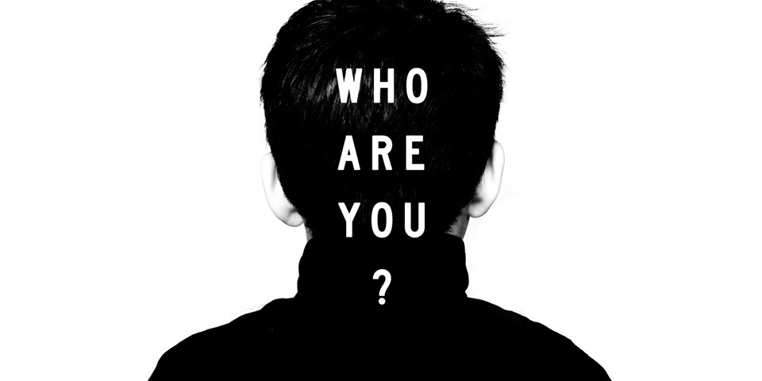

# Before starting ...

## La formation

Formation de 4 jours (28 heures) - Code : S-RES

## Sommaire
- L’Environnement
- Les Attaques
- Les Protections
- La sécurité des échanges, la cryptographie

### Objectifs pédagogiques

* Comprendre les impacts du numérique
* Maitriser les risques
* Appliquer les bonnes pratiques 
* Adapter la sécurité au contexte numérique
* Appliquer les normes et standars de sécurité

----

### Profil des participants?

* Dirigeants et responsables d'entreprise
* Responsables RSE, RH, QSE, DSI, RSSI ?
* Décideurs, responsables informatiques, chefs de produits, expert technique

----

## Qui êtes vous ?

### Petit tour de présentation... avec 3 questions

* Passé : Quel est votre "bagage" ? (expérience, compétences, etc.)
* Présent : Pourquoi participez vous à cette formation aujourd'hui ?
* Futur : Comment utiliserez-vous ces nouvelles compétences d'ici 2 ou 5 ans ?
* Extra : Si je ne devais me rappeler que d'une seule chose à sur vous ...?

----

## Qui suis-je ?

* Yohann Durand
* Développeur de formation depuis 2018, j'ai lancé ma propre entreprise de services en 2021
* Actuellement développeur chez BoldCode
* Compétences en informatique, sécurité, intelligence artificielle, et blockchain
* Passionné par le sport, le tennis, la photo et la nature

----

## Déroulement de la formation & règles du jeu

### Horaires

* 9h00 - 12h30
* 13h30 - 17h00 (ou 14h - 17h30 ?)
* Des pauses le matin et l'après midi (~10h30, ~15h30, plus si nécessaire)

### Le cadre

* Neutralité temporaire des rôles hiérarchiques et des relations interpersonnelles dans le groupe
* Liberté de parole dans le respect des autres et des objectifs de la formation
* Bienveillance, nous sommes dans un espace d’apprentissage
* Confidentialité de l’animateur et des participants sur les échanges

### Encore quelques règles

* En visio:
  * __Microphone désactivé__ (sauf pour prendre la parole)
  * __Caméra éteinte__ (sauf pendant les discussions en début / fin de cours)
* __Des questions ?__ Levez votre main numérique ou interrompez simplement mon exposé.
* __Les supports de présentation seront remis__ en fin de formation.

----