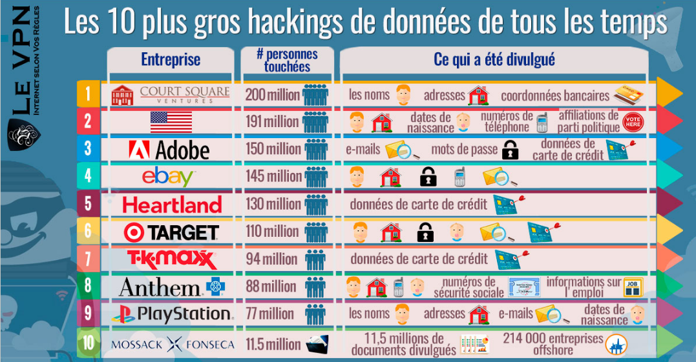
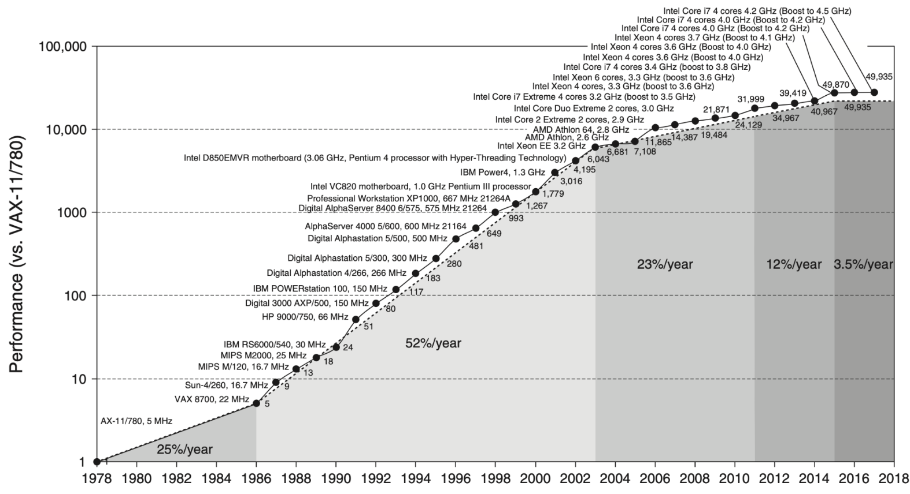

# La sécurité informatique, un enjeu fort

* Pourquoi la sécurité informatique est-elle devenue un enjeu majeur, voire une question de survie, pour les organisations et les individus ?
* L'importance cruciale de la sécurité informatique dans un monde hyperconnecté où chaque clic peut avoir des conséquences désastreuses.
* Ce chapitre vise à vous ouvrir les yeux sur les dangers réels qui nous guettent et à vous donner envie de vous protéger.

## Les plus grandes attaques de l'histoire cyber : un aperçu terrifiant

* Pour bien comprendre les enjeux de la sécurité informatique, il est essentiel de connaître les attaques qui ont marqué l'histoire. Ces exemples concrets nous montrent l'étendue des dégâts que peuvent causer les cybercriminels.

  * **2016 : L'année cruciale des ransomwares**
    * 2016 a été l'année de l'explosion des ransomwares, ces logiciels qui prennent vos données en otage et exigent une rançon.
    * Depuis, les hackers et leurs méthodes n'ont cessé d'évoluer, profitant même de périodes sensibles comme la pandémie de Covid-19.

  * **Le cheval de Troie Locky (2016)**
    * Un ransomware véhiculé par e-mail, caché dans un document Word.
    * Une fois ouvert, Locky crypte toutes vos données et demande une rançon.
    * Plus de 90 000 personnes infectées par jour, bloquant l'accès aux données de millions de personnes.
    * Coût estimé : 7 millions de dollars de rançons payées la première année.

  * **Le ransomware Wannacry (2017)**
    * A touché plus de 230 000 ordinateurs dans 150 pays.
    * A exploité une faille de sécurité présente sur les systèmes Windows antérieurs à Windows 10.
    * Coût estimé : plus de 4 milliards de dollars de pertes à travers le monde.
    * A notamment paralysé les hôpitaux NHS au Royaume-Uni.

  * **Le virus Petya (2016)**
    * Un ransomware qui chiffre les données présentes sur les ordinateurs utilisant Windows.
    * A touché de grosses structures comme l'aéroport de Kiev, la banque centrale ukrainienne et la franchise française Saint-Gobain.
    * Coût estimé : plus d'un milliard de dollars de pertes.

  * **Le virus Not Petya (2017)**
    * Un logiciel malveillant qui efface les données de votre ordinateur, les rendant irrécupérables sans paiement d'une rançon.
    * A frappé de nombreuses entreprises nationales et internationales comme la SNCF, Nivea, Auchan et TNT Express.
    * Coût estimé : plus de 400 millions de dollars perdus par TNT Express et 870 millions de dollars pour les laboratoires américains Merck.

  * **Le malware Emotet (actuellement en circulation)**
    * Une attaque informatique qui vise à infecter les boîtes mails et à récolter les données présentes sur les ordinateurs ou le réseau.
    * Imite de récents échanges avec vos correspondants et soumet une pièce jointe malveillante.
    * Capable d'envoyer 500 000 emails par jour.
    * A touché des entreprises comme Bayer, des entités gouvernementales comme la ville de Francfort (contrainte de fermer son réseau informatique), et de simples individus.

  * **Le logiciel espion Pegasus : L'arme des États (toujours en activité)**
    * Développé par la société israélienne NSO Group, Pegasus est un logiciel espion extrêmement puissant capable d'infiltrer les téléphones portables (principalement iOS et Android) à distance.
    * Il peut accéder aux messages, aux appels, aux photos, aux e-mails, à la localisation et même activer le microphone et la caméra à l'insu de l'utilisateur.
    * **Commanditaires :** Vendu exclusivement à des gouvernements et agences gouvernementales, Pegasus a été utilisé par plusieurs pays à travers le monde.
    * **Cibles :** Journalistes, activistes des droits de l'homme, avocats, hommes politiques et même chefs d'État ont été espionnés grâce à ce logiciel.
    * **Enjeux :** Pegasus soulève de graves questions sur la surveillance de masse, la violation de la vie privée et l'utilisation abusive de technologies de surveillance par les États. Il représente une menace pour la démocratie et la liberté d'expression.

* Ces attaques nous rappellent que personne n'est à l'abri et qu'il est essentiel d'agir en conséquence pour protéger nos systèmes et nos données.

## L'omniprésence des menaces : Un tsunami numérique

* Les menaces informatiques ne sont plus une vaguelette, mais un véritable tsunami qui submerge nos systèmes.
  * **Explosion des attaques de ransomware :** En 2024, une entreprise est victime d'un ransomware toutes les 11 secondes, avec un coût moyen de plus de 2 millions d'euros par incident (Source : CyberSecurity Ventures). Imaginez votre entreprise paralysée, vos données cryptées et une rançon exorbitante à payer.
  * **Phishing : L'arme de manipulation massive :** 90% des violations de données sont causées par des erreurs humaines, souvent liées au phishing (Source : Verizon Data Breach Investigations Report). Un simple e-mail frauduleux peut ouvrir les portes de votre système à des criminels.
  * **Vulnérabilités logicielles :** Des bombes à retardement : Plus de 20 000 nouvelles vulnérabilités sont découvertes chaque année (Source : National Vulnerability Database). Chaque faille non corrigée est une porte ouverte aux attaques.
  * **Attaques ciblées :** La traque aux données précieuses : Les attaques ciblées contre les entreprises ont augmenté de 67% en 5 ans (Source : Accenture). Les organisations sont traquées pour leurs données sensibles, leur propriété intellectuelle et leurs informations financières.

## Les conséquences d'une violation de sécurité : Un cataclysme pour votre organisation

* Les violations de sécurité ne sont pas de simples incidents, mais de véritables cataclysmes qui peuvent détruire votre organisation.
  * **Pertes financières :** Le coût moyen d'une violation de données dépasse les 4 millions d'euros (Source : IBM Cost of a Data Breach Report). Ces pertes comprennent les coûts de récupération, les amendes, la perte de clients et les dommages à la réputation.
  * **Atteinte à la réputation :** La confiance brisée : 60% des clients se détournent d'une entreprise après une violation de données (Source : Ponemon Institute). La perte de confiance est difficile à réparer et peut entraîner la faillite.
  * **Vol de données sensibles :** Un trésor entre de mauvaises mains : Des millions de données personnelles sont volées chaque jour. Ces informations peuvent être utilisées pour des fraudes, des usurpations d'identité et d'autres activités criminelles.
  * **Interruption des activités :** La paralysie de votre organisation : Une attaque informatique peut paralyser vos systèmes pendant des jours, voire des semaines, entraînant des pertes de productivité et des retards importants.
  * **Conséquences juridiques :** Le prix de la négligence : Le non-respect des réglementations sur la protection des données peut entraîner des amendes Records, allant jusqu'à 4% du chiffre d'affaires annuel mondial (Source : RGPD).

## Les enjeux économiques : La sécurité, un investissement indispensable

* La sécurité informatique n'est pas une dépense, mais un investissement vital pour assurer la pérennité de votre activité.
  * **Protection de la propriété intellectuelle :** La perte de secrets commerciaux peut anéantir des années de recherche et de développement.
  * **Maintien de la compétitivité :** Une entreprise qui ne prend pas la sécurité au sérieux risque de perdre des parts de marché au profit de ses concurrents.
  * **Confiance des clients :** Les clients sont de plus en plus attentifs à la sécurité de leurs données et sont prêts à changer de fournisseur si nécessaire.
  * **Respect des réglementations :** La conformité aux réglementations sur la protection des données est un impératif pour éviter les sanctions financières et les atteintes à la réputation.

## L'impact de la non-conformité : Les risques

* Après avoir vu les attaques les plus marquantes, il est temps de prendre conscience des conséquences désastreuses du non-respect des règles de sécurité. 
  * **Sanctions financières : Des amendes records**
    * **Le RGPD** (Règlement Général sur la Protection des Données) prévoit des amendes pouvant atteindre 4% du chiffre d'affaires annuel mondial de votre entreprise, ou 20 millions d'euros, selon le montant le plus élevé.
    * D'autres réglementations sectorielles (comme HIPAA pour la santé aux États-Unis) prévoient également des sanctions financières considérables en cas de non-conformité.
  * **Responsabilité civile : Payer pour les dégâts causés**
    * En cas de violation de données, vous pouvez être tenu responsable des dommages causés à vos clients, partenaires et employés. Ces dommages peuvent inclure la perte de données personnelles, la fraude financière, le vol d'identité, etc.
    * Les coûts de réparation de ces dommages peuvent s'élever à des millions d'euros, voire plus.
  * **Responsabilité pénale : Aller en prison**
    * Dans certains cas, les dirigeants d'entreprises peuvent être poursuivis pénalement pour des infractions liées à la sécurité informatique. Les sanctions peuvent inclure des amendes et des peines de prison.
    * La négligence en matière de sécurité peut être considérée comme une faute grave, engageant la responsabilité personnelle des dirigeants.

## La croissance de la technologie et la puissance de calcul

La loi de Moore, qui stipule que le nombre de transistors sur une puce de microprocesseur double environ tous les deux ans, illustre de manière frappante l'évolution rapide de la puissance de calcul. Cette croissance exponentielle a un impact direct sur la cybersécurité des systèmes d'information:

*   **Augmentation de la surface d'attaque :**
  *   **Plus de dispositifs connectés :** La loi de Moore a permis la prolifération d'appareils connectés (ordinateurs, smartphones, objets IoT), augmentant considérablement la surface d'attaque potentielle pour les cybercriminels.
  *   **Systèmes plus complexes :** Des systèmes d'information plus puissants et complexes impliquent une augmentation des lignes de code et des interdépendances, ce qui accroît le risque de vulnérabilités.
*   **Sophistication des menaces :**
  *   **Outils d'attaque plus puissants :** Les attaquants bénéficient également de la loi de Moore, leur permettant de développer des outils d'attaque plus sophistiqués et automatisés, capables de tester rapidement des milliers de combinaisons pour exploiter les failles.
  *   **Craquage de mots de passe plus rapide :** L'augmentation de la puissance de calcul facilite le craquage des mots de passe, rendant les mots de passe faibles encore plus vulnérables.