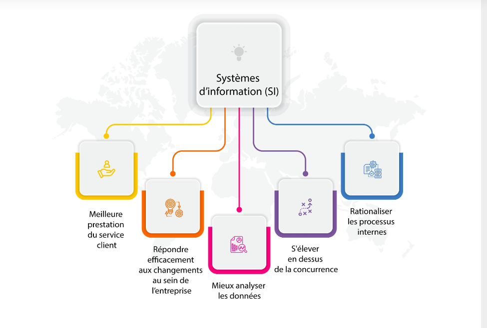

# Systeme d'information (SI)

*   Définition d'un Système d'Information (SI)
*   Pourquoi est-il essentiel de comprendre le SI dans un contexte de sécurité ?
*   Le SI comme un ensemble de ressources interconnectées.

## Qu'est-ce qu'un Système d'Information ?

*   Un ensemble organisé d'éléments :
  *   Matériel (Hardware)
  *   Logiciel (Software)
  *   Données
  *   Procédures
  *   Ressources Humaines
*   Objectif : Collecter, traiter, stocker et diffuser l'information.
*   Le SI au service des objectifs de l'organisation.

## Les composantes clés du SI

*   **Matériel (Hardware)**
  *   Serveurs
  *   Postes de travail
  *   Équipements réseau (routeurs, commutateurs, pare-feu)
  *   Périphériques (imprimantes, scanners, etc.)
*   **Logiciel (Software)**
  *   Systèmes d'exploitation
  *   Applications métier (CRM, ERP, etc.)
  *   Bases de données
  *   Logiciels de sécurité (antivirus, IDS, etc.)
*   **Données**
  *   Informations structurées (bases de données)
  *   Informations non structurées (documents, e-mails, etc.)
  *   Métadonnées
*   **Procédures**
  *   Processus métier
  *   Politiques de sécurité
  *   Procédures de sauvegarde et de restauration
  *   Plans de reprise d'activité (PRA) et de continuité d'activité (PCA)
*   **Ressources Humaines**
  *   Utilisateurs
  *   Administrateurs système et réseau
  *   Responsables de la sécurité des SI (RSSI)
  *   Développeurs

## À Quoi Sert un Système d’Information ?



* **Automatiser les Processus Métier**
  *  Réduire les erreurs manuelles.
  *  Accélérer les tâches répétitives (facturation, inventaire).
*  **Améliorer la Prise de Décision**
  *  Grâce à des données en temps réel et des tableaux de bord analytiques, les dirigeants peuvent agir avec précision.
*  **Favoriser la Collaboration**
  *  Les outils comme Microsoft Teams, Slack ou Google Workspace centralisent les échanges et les documents.
*  Renforcer la Relation Client
  *  Les CRM (Customer Relationship Management) personnalisent les interactions et suivent l’historique des clients.
*  **Assurer la Conformité**
  *  Les SI aident à respecter les réglementations (RGPD, normes sectorielles) via des audits et des contrôles automatisés.

----

## Le SI et la sécurité

*   Le SI, une cible privilégiée pour les attaques.
*   Les enjeux de la sécurité du SI :
  *   Protection des données sensibles
  *   Maintien de la disponibilité des services
  *   Préservation de l'intégrité des informations
  *   Respect des obligations légales et réglementaires
*   L'importance d'intégrer la sécurité dès la conception du SI.

----

## La donnée : Cœur du système d'information

*   La donnée : un actif essentiel pour l'organisation.
*   Importance de la protection de la donnée.
*   Cycle de vie de la donnée.

### Définition et Caractéristiques

*   **Définition de la donnée :**
  *   Information brute ou traitée.
  *   Représentation d'un fait, d'une notion, d'un événement.
*   **Types de données :**
  *   Données structurées (bases de données relationnelles).
  *   Données non structurées (documents, images, vidéos, informations).
  *   Données semi-structurées (fichiers XML, JSON).
*   **Propriétés de la donnée :**
  *   Pertinence.
  *   Exactitude.
  *   Actualité.
  *   Accessibilité (Qui doit avoir accés?)

**TP: 15min**: Etats des lieux de vos données perso/pro sur internet

#### Données Personnelles (RGPD)

* **Données d'identification**
  - Nom, prénom
  - Date de naissance
  - Adresse postale
  - Email, téléphone
  - Photos identifiables

* **Données sensibles**
  - Santé
  - Opinions politiques
  - Convictions religieuses
  - Données biométriques
  - Orientation sexuelle
  - Origine ethnique

* **Données de connexion**
  - Adresse IP
  - Cookies
  - Historique de navigation
  - Géolocalisation

#### Données Professionnelles

* **Données stratégiques**
  - Secrets commerciaux
  - Brevets
  - Plans de développement
  - Données financières
  - Contrats clients

* **Données opérationnelles**
  - Emails professionnels
  - Documents internes (facture, docs technique..)
  - Procédures
  - Rapports d'activité
  - Base clients

* **Données techniques**
  - Codes sources
  - Configurations systèmes
  - Documentation technique
  - Logs systèmes

#### Données : Classification par niveau de sensibilité

* **Public** (🟢)
  - Accessible à tous
  - Brochures commerciales
  - Site web public
  - Communiqués de presse

* **Interne** (🟡)
  - Réservé aux employés
  - Notes de service
  - Procédures internes
  - Annuaire d'entreprise

* **Confidentiel** (🟠)
  - Accès restreint
  - Données clients
  - Contrats
  - Données RH

* **Secret** (🔴)
  - Accès très limité
  - Stratégie d'entreprise
  - Propriété intellectuelle
  - Données R&D
----

#### 4. Critères de classification

Pour définir la classification d'une donnée, évaluer :

1. **Impact en cas de fuite**
   ```
   Faible    → Public
   Moyen     → Interne
   Important → Confidentiel
   Critique  → Secret
   ```

2. **Obligations légales**
   ```
   RGPD
   Secret professionnel
   Propriété intellectuelle
   Réglementations sectorielles
   ```

3. **Valeur business**
   ```
   Stratégique
   Opérationnelle
   Financière
   Commerciale
   ```

4. **Durée de conservation**
   ```
   Court terme  : < 1 an
   Moyen terme  : 1-5 ans
   Long terme   : 5-10 ans
   Archivage    : > 10 ans
   ```

### Cycle de Vie de la Donnée

*   **Création / Collecte :**
  *   Origine des données (interne, externe).
  *   Méthodes de collecte (manuelle, automatique).
*   **Stockage :**
  *   Choix des supports de stockage (disques durs, SSD, cloud).
  *   Organisation des données (bases de données, fichiers).
*   **Utilisation / Traitement :**
  *   Exploitation des données pour les processus métier.
  *   Analyses et reporting.
*   **Archivage :**
  *   Conservation des données à long terme.
  *   Conformité réglementaire.
*   **Destruction :**
  *   Suppression sécurisée des données.
  *   Respect des règles de confidentialité.

### Enjeux de Sécurité Liés à la Donnée

*   **Confidentialité :**
  *   Protection contre les accès non autorisés.
  *   Chiffrement des données sensibles.
*   **Intégrité :**
  *   Prévention des modifications non autorisées.
  *   Contrôle d'accès.
*   **Disponibilité :**
  *   Garantir l'accès aux données en cas de besoin.
  *   Sauvegardes et restauration.

----