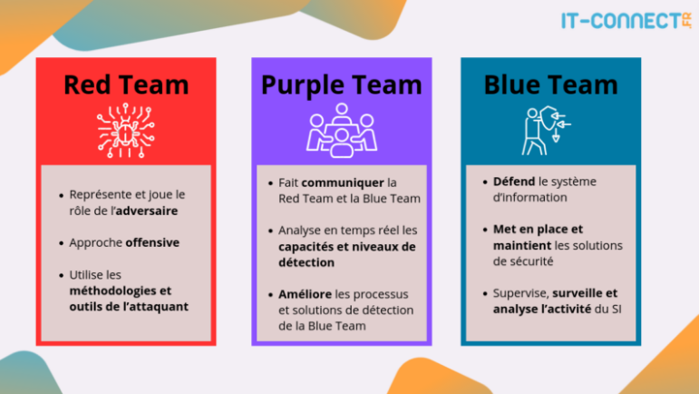

# Metier de la securité

## Red Team, Blue Team, Purple Team: Les forces en présence de la cybersécurité

*  Dans le domaine de la cybersécurité, on distingue souvent trois équipes aux rôles complémentaires :

  *  **Red Team (Équipe Rouge):** Elle joue le rôle des attaquants. Son objectif est de simuler des cyberattaques réalistes pour tester les défenses de l'organisation. Les membres de la Red Team sont des experts en intrusion, en exploitation de vulnérabilités et en ingénierie sociale. Métiers typiques : Testeur d'intrusion (pentester), analyste de vulnérabilités, expert en sécurité offensive.

  *  **Blue Team (Équipe Bleue):** Elle incarne la défense. Son rôle est de protéger les systèmes d'information de l'organisation, de détecter les attaques et d'y répondre. Les membres de la Blue Team sont des experts en sécurité défensive, en surveillance des réseaux et en gestion des incidents. Métiers typiques : Analyste SOC (Security Operations Center), ingénieur sécurité, administrateur système sécurité.

  *  **Purple Team (Équipe Violette):** Elle assure la communication et la collaboration entre la Red Team et la Blue Team. Son objectif est d'optimiser les exercices de simulation d'attaque et daméliorer les capacités de défense de lorganisation. Les membres de la Purple Team ont une bonne connaissance des techniques dattaque et de défense. Métiers typiques : Coordinateur sécurité, consultant en cybersécurité, responsable de la gestion des risques.

## Les différents domaines de la cyber-securité:

*   La cyber-sécurité englobe une variété de domaines, chacun ayant ses propres compétences et outils.
  *   **Sécurité des réseaux :**
    *   Définition : Protection des infrastructures réseau contre les intrusions et les attaques.
    *   Activités : Configuration de pare-feu, détection d'intrusion, segmentation du réseau, etc.
  *   **Sécurité des systèmes :**
    *   Définition : Protection des systèmes d'exploitation et des applications contre les vulnérabilités et les attaques.
    *   Activités : Durcissement des systèmes, gestion des correctifs, contrôle d'accès, etc.
  *   **Sécurité des applications :**
    *   Définition : Protection des applications web et mobiles contre les vulnérabilités et les attaques.
    *   Activités : Tests de sécurité applicatifs, développement sécurisé, validation des entrées, etc.
  *   **Sécurité des données :**
    *   Définition : Protection de la confidentialité, de l'intégrité et de la disponibilité des données.
    *   Activités : Chiffrement des données, contrôle d'accès, sauvegarde et restauration, etc.
  *   **Gestion des identités et des accès (IAM) :**
    *   Définition : Gestion des identités numériques et des droits d'accès aux ressources.
    *   Activités : Authentification multi-facteurs, gestion des rôles et des permissions, etc.
  *   **Réponse aux incidents :**
    *   Définition : Détection, analyse et résolution des incidents de sécurité.
    *   Activités : Analyse des journaux d'événements, investigation forensique, confinement des incidents, etc.
  *   **Analyse forensique numérique (Forensics) :**
    *   Définition : Collecte et analyse de preuves numériques pour identifier les causes et les auteurs d'incidents de sécurité.
    *   Activités : Acquisition de données, analyse de disques durs, analyse de la mémoire vive, etc.
  *   **Stéganographie :**
    *   Définition : Technique consistant à cacher des informations dans d'autres informations (images, audio, vidéo, etc.).
    *   Utilisations : Communication secrète, dissimulation de preuves, etc.
  *   **OSINT (Open Source Intelligence) :**
    *   Définition : Collecte et analyse d'informations disponibles publiquement sur Internet pour identifier des menaces ou des vulnérabilités.
    *   Activités : Recherche sur les moteurs de recherche, les réseaux sociaux, les forums, etc.
  *   **Analyse de malwares :**
    *   Définition : Analyse du code malveillant pour comprendre son fonctionnement et identifier les mesures de protection.
    *   Activités : Analyse statique et dynamique du code, rétro-ingénierie, etc.
  *   **Sécurité du cloud :**
    *   Définition : Protection des données et des applications hébergées dans le cloud.
    *   Activités : Configuration des paramètres de sécurité du cloud, gestion des identités et des accès, chiffrement des données, etc.
  *   **Sécurité de l'Internet des objets (IoT) :**
    *   Définition : Protection des dispositifs connectés contre les vulnérabilités et les attaques.
    *   Activités : Durcissement des dispositifs, sécurisation des communications, etc.

----

## Les différents métiers de la sécurité

Voir PDF
[https://cyber.gouv.fr/publications/panorama-des-metiers-de-la-cybersecurite](https://cyber.gouv.fr/publications/panorama-des-metiers-de-la-cybersecurite)

*   La sécurité informatique offre une variété de métiers, chacun ayant ses propres spécificités et exigences.
  *   **RSSI (Responsable de la Sécurité des Systèmes d'Information) :**
    *   Définition : Le RSSI est responsable de la définition et de la mise en œuvre de la politique de sécurité de l'organisation.
    *   Responsabilités :
      *   Analyse des risques et élaboration de plans de sécurité.
      *   Gestion des incidents de sécurité.
      *   Sensibilisation et formation des utilisateurs.
      *   Veille technologique et réglementaire.
  *   **Analyste en sécurité :**
    *   Définition : L'analyste en sécurité est chargé d'identifier et d'évaluer les risques et les vulnérabilités des systèmes d'information.
    *   Responsabilités :
      *   Réalisation d'audits de sécurité.
      *   Tests d'intrusion.
      *   Analyse des journaux d'événements (logs).
      *   Mise en place de mesures de sécurité.
  *   **Ingénieur en sécurité :**
    *   Définition : L'ingénieur en sécurité est responsable de la conception, de la mise en œuvre et de la maintenance des solutions de sécurité.
    *   Responsabilités :
      *   Configuration des pare-feu et des systèmes de détection d'intrusion.
      *   Gestion des identités et des accès.
      *   Chiffrement des données.
      *   Automatisation des tâches de sécurité.
  *   **Administrateur de la sécurité :**
    *   Définition : L'administrateur de la sécurité est chargé de gérer et de maintenir les outils et les systèmes de sécurité.
    *   Responsabilités :
      *   Gestion des antivirus et des anti-malware.
      *   Surveillance des alertes de sécurité.
      *   Application des correctifs de sécurité.
      *   Gestion des sauvegardes et des restaurations.
  *   **Consultant en sécurité :**
    *   Définition : Le consultant en sécurité conseille les organisations sur les meilleures pratiques en matière de sécurité.
    *   Responsabilités :
      *   Réalisation d'audits de sécurité.
      *   Élaboration de plans de sécurité.
      *   Formation du personnel.
      *   Veille technologique et réglementaire.
  *   **Pentester (Testeur d'intrusion) :**
    * Définition : Le pentester simule des attaques réelles pour identifier les failles de sécurité dans les systèmes d'information.
    * Responsabilités:
      * Planification et exécution de tests d'intrusion.
      * Rédaction de rapports détaillés sur les vulnérabilités découvertes.
      * Recommandation de mesures correctives.

## Les compétences clés

*   Pour réussir dans les métiers de la sécurité, certaines compétences sont essentielles :
  *   Connaissances techniques approfondies en informatique et en réseaux.
  *   Maîtrise des outils et des techniques de sécurité.
  *   Capacité d'analyse et de résolution de problèmes.
  *   Sens de la communication et de la pédagogie.
  *   Rigueur et organisation.
  *   Curiosité et veille technologique.