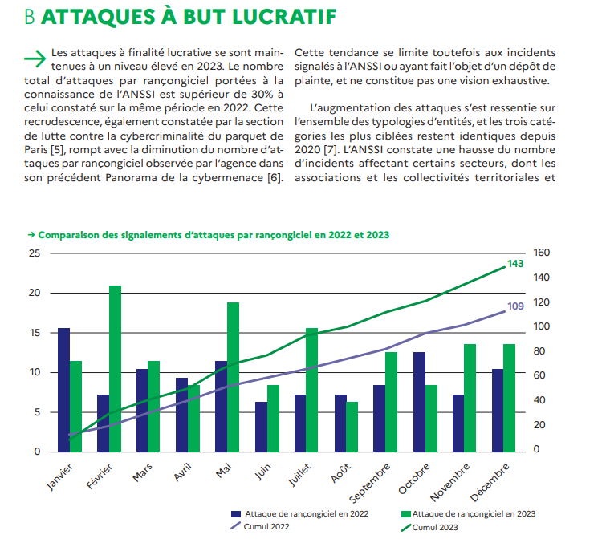

# La réalité des attaques

## Introduction

*   Pourquoi est-il absolument crucial de comprendre la réalité des attaques informatiques, et comment cela impacte directement votre futur ?

*   **Statistique** Le coût global de la cybercriminalité devrait atteindre 10,5 billions de dollars par an d'ici 2025 (Source : Cybersecurity Ventures).
*   **Statistique** 68 % des attaques ciblent les petites entreprises (Source : National Cyber Security Alliance). La taille n'est pas une protection, mais une cible facile.
*   **Statistique** L'ingénierie sociale est impliquée dans 85 % des violations de données (Source : Verizon Data Breach Investigations Report). La plus grande faille de sécurité, c'est l'humain.
*   **Statistique** 56 % des entreprises ont subi une attaque réseau au cours des 12 derniers mois (Source : Cisco Annual Internet Report).
*   **Statistique** Les applications web sont le vecteur d'attaque le plus courant, représentant 24 % des violations de données (Source : Verizon Data Breach Investigations Report).

## Statistiques sur les attaques

*   Les attaques visent des objectifs précis et ciblent des éléments spécifiques des systèmes d'information.
*   **Statistique** 71 % des entreprises ont subi au moins une attaque ayant réussi à pénétrer leur système en 2023 (Source : Ponemon Institute)..

  * Interruption : attaque sur la disponibilité
    * **Objectif :** Rendre un service indisponible, semer le chaos.
    * **Statistique** Les attaques DDoS (déni de service) ont augmenté de 151 % au premier semestre 2024 (Source : Nexusguard).
    * **Méthodes :** Attaques par déni de service (DoS), coupures d'alimentation, etc.

  * Interception : attaque sur la confidentialité
    * **Objectif :** Accéder à des informations confidentielles sans autorisation, vendre vos secrets.
    * **Statistique** En moyenne, 2 379 enregistrements sont compromis chaque jour à cause de violations de données (Source : Risk Based Security).
    * **Méthodes :** Sniffing de réseau, écoute clandestine, etc.

  * Modification : attaque sur l’intégrité
    * **Objectif :** Modifier des données ou des systèmes pour causer des dommages ou obtenir un avantage, manipuler la réalité.
    * **Statistique** 20 % des entreprises ont subi une altération de leurs données en 2023 (Source : Global Data Protection Index).
    * **Méthodes :** Altération de fichiers, falsification de données, etc.

  * Spoofing/Forge : attaque sur l’authenticité
    * **Objectif :** Se faire passer pour une autre personne ou un autre système, usurper votre identité.
    * **Statistique** Les attaques de phishing ont augmenté de 61 % en 2023 (Source : Anti-Phishing Working Group).
    * **Méthodes :** Usurpation d'adresse IP, création de faux certificats, etc.

