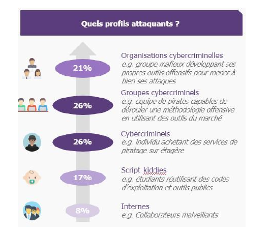
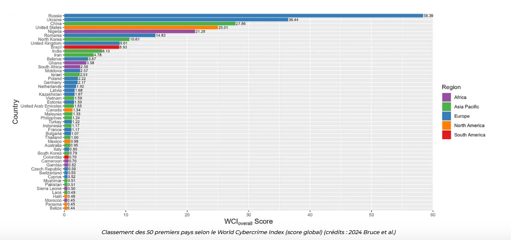
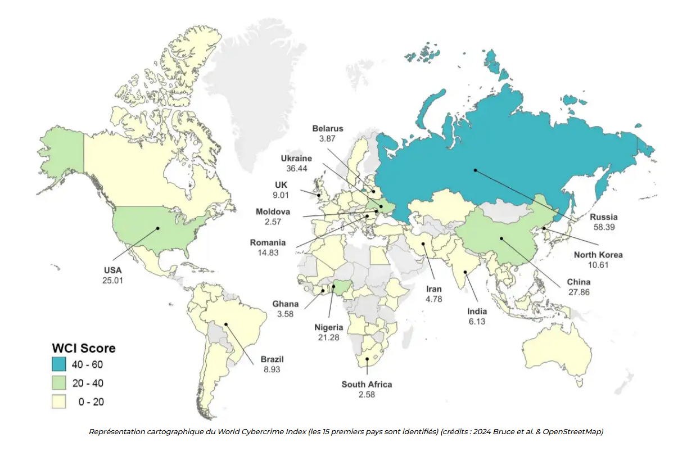
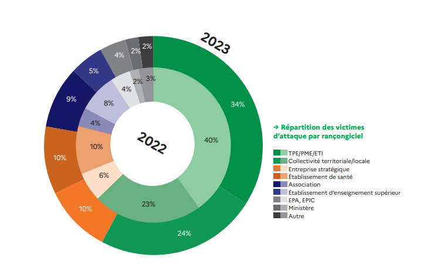

# Origine et cible des attaques

## Origine des attaques

### Qui sont les attaquants ? 

### Les différents types de hackers

Il est important de noter que le terme 'hacker' est souvent utilisé à tort pour désigner uniquement les cybercriminels. 
À l'origine, un hacker est simplement une personne passionnée d'informatique, dotée d'une grande curiosité et d'une soif d'apprendre. 

Les hackers explorent les systèmes, cherchent à comprendre leur fonctionnement et à les améliorer, souvent par pure curiosité intellectuelle. C'est l'utilisation malveillante de ces compétences qui transforme un hacker en criminel.

  * **Les Black Hats (Chapeaux Noirs) : Les criminels du cyberespace**
    * Ce sont les "méchants" par excellence. Leur objectif principal est de gagner de l'argent, de voler des informations ou de causer des dommages.
    * Ils utilisent des techniques illégales pour exploiter les vulnérabilités des systèmes et des applications.
    * Exemples : Pirates qui volent des données bancaires, auteurs de ransomwares, espions industriels.
    * **Leur devise :** "Le profit avant tout, peu importe les conséquences".

  * **Les Grey Hats (Chapeaux Gris) : Entre le bien et le mal**
    * Ils se situent dans une zone grise, entre les Black Hats et les White Hats.
    * Ils peuvent parfois agir de manière illégale, mais sans intention malveillante.
    * Par exemple, ils peuvent découvrir une vulnérabilité et la révéler publiquement avant d'en informer le fournisseur, dans le but de forcer ce dernier à corriger rapidement le problème.
    * **Leur devise :** "La fin justifie les moyens".

  * **Les White Hats (Chapeaux Blancs) : Les défenseurs du cyberespace**
    * Ce sont les "gentils". Leur objectif est de protéger les systèmes et les données contre les attaques.
    * Ils utilisent leurs compétences de manière légale et éthique.
    * Ils réalisent des tests d'intrusion pour identifier les vulnérabilités, mettent en place des mesures de sécurité et forment les utilisateurs aux bonnes pratiques.
    * **Leur devise :** "Protéger et servir".

### Origine par pays 

*  La Russie arrive en tête concernant l'origine des cyberattaques pour plusieurs raisons :
  *  **Stratégie gouvernementale :** La Russie a développé une stratégie cyber agressive depuis 2014, investissant massivement dans ses capacités offensives23.
  *  Groupes cybercriminels prolifiques : Des groupes russes comme Wizard Spider, TA505 et FIN7 sont parmi les plus actifs et dangereux au monde1.
  *  **Cyberguerre et géopolitique :** La Russie utilise les cyberattaques comme outil de politique étrangère, notamment contre l'Ukraine et les pays occidentaux23.
  *  Infrastructure développée : Le pays dispose d'agences spécialisées, de services secrets et d'unités de hackers dédiées aux opérations cyber2.
  *  **Historique d'attaques majeures :** La Russie est soupçonnée d'être derrière plusieurs cyberattaques historiques, comme celles contre l'Estonie en 2007 et la Géorgie en 20083.

## Cible des attaques

 (Source: ANNSI)

### Cible du systéme d'information

* Les attaquants peuvent cibler différents éléments des systèmes d'information.
  * Les terminaux (postes de travail, serveurs)
  * Les réseaux
  * Les applications

#### Attaques du terminal

* Les terminaux (ordinateurs, smartphones, etc.) sont des cibles fréquentes pour les attaques.

  * Attaques de type “malware” : Utilisation de virus, chevaux de Troie, etc.
  * Attaques de type “non-malware” : Exploitation de failles de sécurité, etc.

#### Attaques sur les réseaux

* Les réseaux sont également des cibles privilégiées pour les attaques.

  * Attaques de type “sniffing” : Interception du trafic réseau pour voler des informations.
  * Attaques de type “DDoS” : Submerger un serveur de requêtes pour le rendre indisponible.
  * Autres attaques en réseau : Exploitation de vulnérabilités, etc.

#### Attaques applicatives

* Les applications sont souvent la porte d'entrée des attaquants.

  * Attaques non-malware
    * Attaques de type “phishing” : Vol d'informations par des e-mails frauduleux.
    * Attaques de type “spear phishing” : Phishing ciblé sur des individus spécifiques.
  * Autres attaques non-malware : Exploitation de vulnérabilités applicatives, etc.

