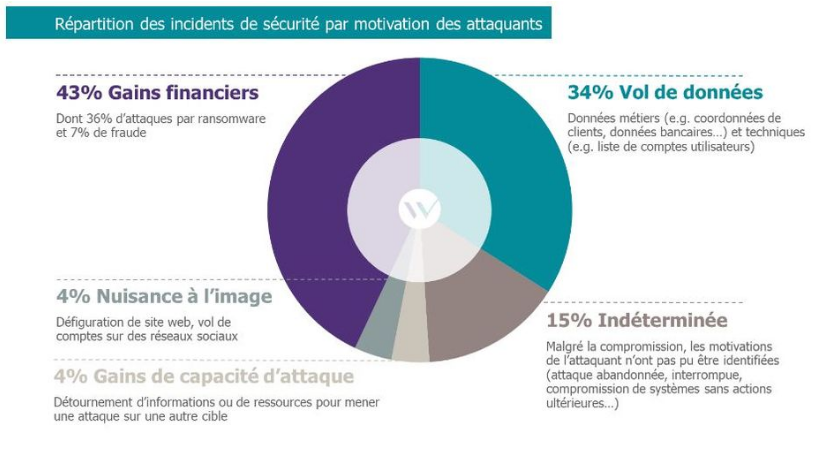
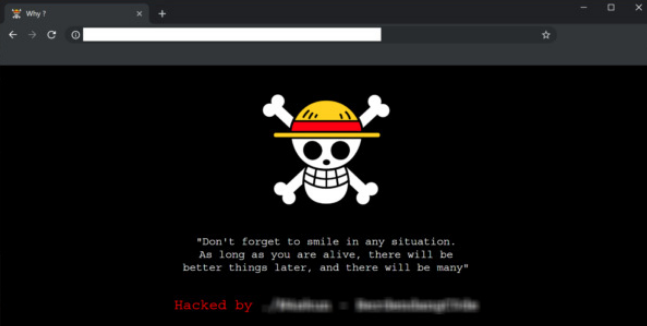
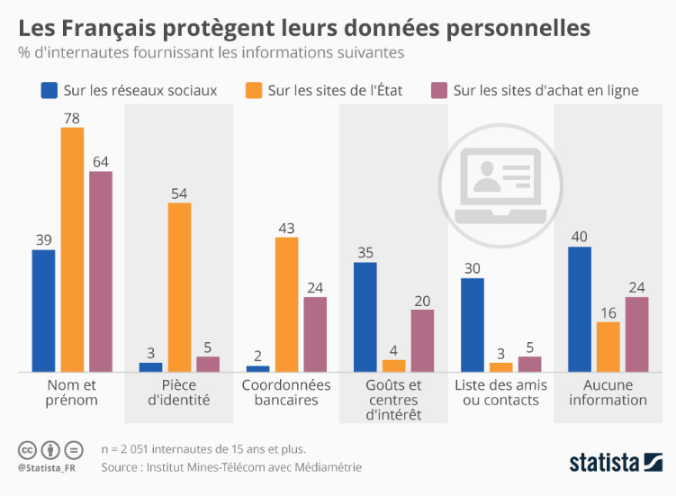

# Les objectifs des attaques

## Les motivations financières : L'appât du gain

* **Vol de données bancaires :** L'objectif est simple : voler des informations de cartes de crédit, des identifiants de comptes bancaires, etc., pour effectuer des achats frauduleux ou vider les comptes des victimes.
* **Ransomware :** Les attaquants chiffrent les données de leurs victimes et exigent une rançon pour les déchiffrer. Le paiement de la rançon est rarement garanti et encourage d'autres attaques.
* **Fraude en ligne :** Création de faux sites web, d'e-mails frauduleux, etc., pour soutirer de l'argent aux victimes.

## L'espionnage : La quête d'informations confidentielles

* **Espionnage industriel :** Vol de secrets commerciaux, de brevets, de plans de développement, etc., pour donner un avantage concurrentiel à une entreprise ou à un État.
* **Espionnage politique :** Vol d'informations sensibles sur les gouvernements, les organisations politiques, les diplomates, etc., pour influencer les décisions politiques ou déstabiliser des pays.
* **Espionnage militaire :** Vol de données sur les armements, les stratégies militaires, les communications, etc., pour obtenir un avantage stratégique.

## La vengeance et le vandalisme : Le plaisir de nuire

* **Vengeance :** Attaques ciblées contre des individus ou des organisations pour se venger d'un préjudice réel ou supposé.
* **Vandalisme :** Destruction de données, sabotage de systèmes, etc., pour le simple plaisir de nuire.
* **Défaçage (Defacing) :** Remplacement de la page d'accueil d'un site web par des messages, des images ou d'autres contenus non autorisés.

Le défaçage est une forme de vandalisme numérique qui vise à humilier, à ridiculiser ou à perturber le fonctionnement normal d'un site web. Il peut être motivé par la vengeance, le simple plaisir de nuire, ou parfois même par la recherche de notoriété au sein de la communauté des hackers.

## Le hacktivisme : La défense d'une cause

* **Hacktivisme :** Utilisation de techniques de hacking pour défendre une cause politique, sociale ou idéologique.
* **Divulgation d'informations :** Révélation de documents confidentiels pour dénoncer des pratiques illégales ou immorales.
* **Perturbation de services :** Attaques contre des sites web ou des systèmes informatiques pour protester contre des actions gouvernementales ou des politiques d'entreprises.

### Exemples de Grands Hacks Motivés par le Hacktivisme

1.  **Anonymous et les Attaques contre les Sites Web Gouvernementaux (Diverses dates)**

    *   **Cause :** Anonymous est un collectif de hacktivistes qui s'engage dans diverses causes politiques et sociales. Ils ont mené de nombreuses attaques contre des sites web gouvernementaux, des entreprises et des organisations qu'ils considèrent comme corrompues ou injustes.
    *   **Techniques :** Anonymous utilise souvent des attaques par déni de service distribué (DDoS) pour mettre hors ligne des sites web. Ils peuvent également défigurer des sites web, voler des données et les divulguer publiquement.
    *   **Exemple :** Après la fermeture du site de partage de fichiers MegaUpload en 2012, Anonymous a mené des attaques DDoS contre les sites web du ministère de la Justice américain, du FBI, de l'industrie du disque américaine (RIAA) et de l'industrie du cinéma américaine (MPAA).

2.  **LulzSec et les Attaques contre Sony Pictures (2011)**

    *   **Cause :** LulzSec était un groupe de hacktivistes qui a mené une série d'attaques spectaculaires en 2011. Ils ont attaqué Sony Pictures pour protester contre les politiques de sécurité laxistes de l'entreprise et pour démontrer leur capacité à violer les systèmes informatiques.
    *   **Techniques :** LulzSec a volé des données confidentielles de Sony Pictures, y compris des informations personnelles de clients, des codes source et des documents internes. Ils ont ensuite divulgué ces données publiquement.
    *   **Impact :** L'attaque a causé d'importants dommages à la réputation de Sony Pictures et a coûté des millions de dollars à l'entreprise.

3.  **WikiLeaks et la Divulgation de Documents Confidentiels (2010-présent)**

    *   **Cause :** WikiLeaks est une organisation qui publie des documents confidentiels divulgués par des sources anonymes. Leur objectif est de promouvoir la transparence et de dénoncer les actes répréhensibles des gouvernements et des entreprises.
    *   **Techniques :** WikiLeaks reçoit des documents confidentiels de sources anonymes et les publie sur son site web. Ils prennent des mesures pour protéger l'identité de leurs sources, mais ils ne sont pas responsables de la manière dont les documents sont obtenus.
    *   **Exemple :** En 2010, WikiLeaks a publié des centaines de milliers de documents confidentiels sur la guerre d'Irak et la guerre d'Afghanistan. Ces divulgations ont eu un impact majeur sur la politique étrangère américaine et ont soulevé des questions importantes sur la transparence gouvernementale.

4.  **Edward Snowden et la Divulgation des Programmes de Surveillance de la NSA (2013)**

    *   **Cause :** Edward Snowden, un ancien employé de la NSA, a divulgué des documents confidentiels sur les programmes de surveillance de masse de la NSA. Il a affirmé qu'il agissait pour protéger la vie privée des citoyens et pour dénoncer les abus de pouvoir du gouvernement.
    *   **Techniques :** Snowden a copié des documents confidentiels de la NSA et les a divulgués à des journalistes.
    *   **Impact :** Les révélations de Snowden ont provoqué un débat mondial sur la surveillance gouvernementale et ont conduit à des réformes des lois sur la vie privée dans de nombreux pays.

## L'utilisation des données privées (Un marché lucratif)

* **Vente de données personnelles :** Les données volées (noms, adresses, numéros de téléphone, adresses e-mail, etc.) sont vendues sur le dark web à des entreprises de marketing, des spammeurs, des escrocs, etc.
* **Usurpation d'identité :** Les données personnelles sont utilisées pour créer de fausses identités, ouvrir des comptes bancaires frauduleux, obtenir des prêts, etc.
* **Chantage :** Les données sensibles (photos compromettantes, informations médicales, etc.) sont utilisées pour faire chanter les victimes.
* **Manipulation :** Les données personnelles sont utilisées pour influencer les opinions politiques, manipuler les élections, etc.

Le marché des données volées est complexe et les prix varient en fonction de la qualité, de la quantité et du type de données. Voici quelques exemples de prix courants :

*   **Informations de Carte de Crédit :**
  *   **Carte de crédit avec CVV :** 5 $ à 110 $ par carte, en fonction de la banque émettrice et des limites de crédit. Les cartes américaines ont tendance à être plus chères.
  *   **Données complètes de carte bancaire (nom, adresse, numéro de téléphone, date de naissance) :** Jusqu'à 200 $ par fiche.

*   **Identifiants de Compte en Ligne :**
  *   **Compte de messagerie électronique :** 1 $ à 50 $, selon la réputation du fournisseur (Gmail, Outlook, etc.) et le contenu du compte (informations financières, contacts professionnels, etc.).
  *   **Compte de réseau social :** 1 $ à 15 $, en fonction du nombre de followers et de l'activité du compte.
  *   **Compte bancaire en ligne :** 50 $ à 1 000 $, en fonction du solde et des autorisations d'accès.

*   **Informations d'Identification Personnelle (PII) :**
  *   **Dossier médical complet :** 100 $ à 1 000 $, en fonction de la qualité et de la quantité des informations contenues. Les dossiers médicaux sont précieux car ils contiennent des informations sensibles qui peuvent être utilisées pour l'usurpation d'identité, la fraude à l'assurance, etc.
  *   **Numéro de sécurité sociale (SSN) :** 1 $ à 10 $. Bien que relativement bon marché individuellement, un SSN peut être utilisé pour commettre une multitude de fraudes.
  *   **Permis de conduire / Carte d'identité :** 5 $ à 20 $

*   **Combinaisons de Données (les duos les plus chers):**
  *   **"Fullz" (Nom complet, Date de naissance, Numéro de Sécurité Sociale, Adresse, Numéro de Permis de conduire, Numéro de Carte de crédit) :**  200 $ - 1000 $. Ces ensembles de données complets permettent l'usurpation d'identité à grande échelle. Ils sont particulièrement prisés lorsqu'ils sont vérifiés et mis à jour.
  *   **Accès Compromis à un Compte Entreprise avec Données Clients :** Des milliers de dollars, voire plus, en fonction de la taille de la base de données clients et de la nature des informations stockées (données financières, informations médicales, etc.).

*   **Autres Données:**
  *   **Mots de passe (hachés) :** Le prix varie considérablement en fonction de la complexité des mots de passe et de la méthode de hachage.

**Facteurs Influant sur les Prix :**

*   **Fraîcheur des données:** Les données les plus récentes sont plus précieuses.
*   **Vérification :** Les données vérifiées (c'est-à-dire qui ont été confirmées comme étant valides) sont plus chères.
*   **Exclusivité :** Les données qui ne sont disponibles que chez un seul vendeur sont plus chères.
*   **Provenance géographique :** Les données provenant de certains pays (par exemple, les États-Unis, le Canada, l'Europe occidentale) sont généralement plus chères.

**Où sont vendues ces données ?**

*   **Dark Web Marketplaces :** Places de marché illégales accessibles via le réseau Tor.
*   **Forums de hackers :** Forums en ligne où les cybercriminels échangent des informations et vendent des données.
*   **Canaux de messagerie chiffrée :** Telegram, Signal, etc., sont parfois utilisés pour la vente de données volées.

Le Dark Web est une partie cachée d'Internet, accessible uniquement via des réseaux spécifiques comme Tor. Il est souvent utilisé pour des activités illégales, mais aussi pour protéger la vie privée et la liberté d'expression

## Dark Web

**Pourquoi le darkweb est techniquement invisible?**

*  Techniquement, le Dark Web n'est pas un "web à part" au sens où il ne s'agit pas d'une infrastructure physique distincte de l'Internet "classique" (Surface Web). Il utilise la même infrastructure (câbles, routeurs, serveurs, etc.) que le reste d'Internet.

  *  **Accès Restreint:** Il nécessite des logiciels et des configurations spécifiques (comme Tor((The Onion Router))) pour y accéder. Vous ne pouvez pas simplement taper une adresse du Dark Web dans votre navigateur habituel et vous attendre à ce qu'elle fonctionne.
  *  **Adressage Spécifique:** Les sites web du Dark Web utilisent des adresses ".onion" qui ne sont pas résolues par le système de nom de domaine (DNS) standard utilisé sur le Surface Web.
  *  **Anonymat et Chiffrement:** Le Dark Web repose sur des technologies de chiffrement et d'anonymisation pour masquer l'identité des utilisateurs et des sites web. Cela crée un environnement distinct de l'Internet "clair" où l'activité est généralement plus visible et traçable.

Tor est indispensable pour accéder au Dark Web car il fournit le chiffrement, le routage anonyme, et la compatibilité avec les adresses ".onion".

Tor c'est aussi la **Protection contre la Censure**

Dans certains pays où l'accès à certains contenus est censuré, **Tor permet de contourner ces restrictions** en anonymisant le trafic et en accédant à des sites qui seraient autrement bloqués.
---

