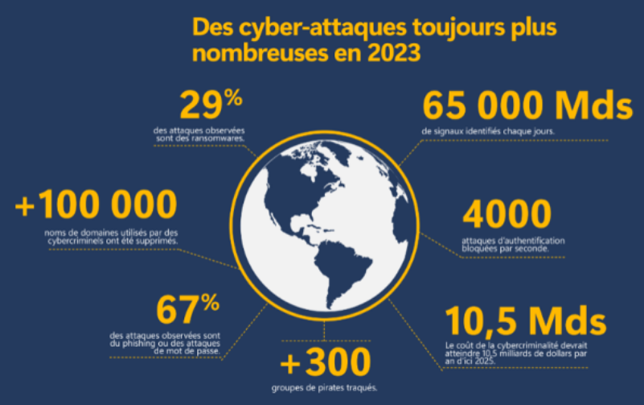
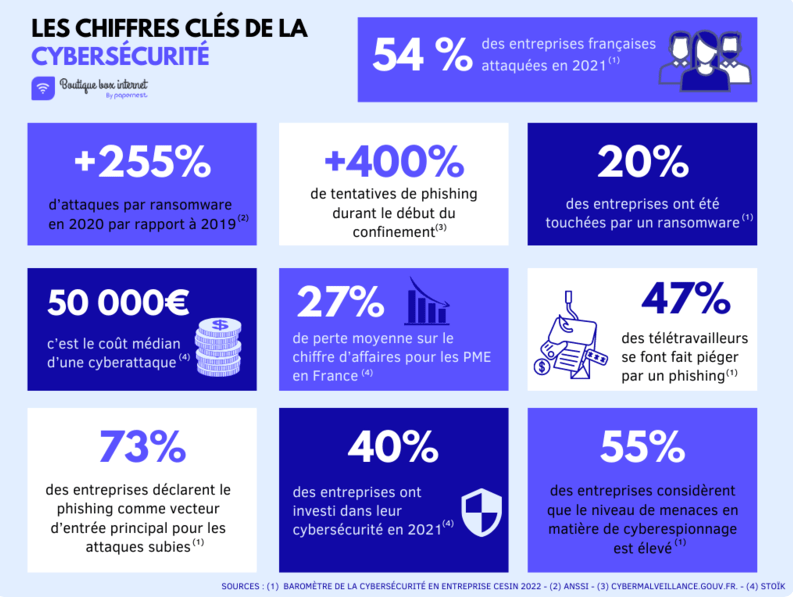

# L'impératif de la défense

## L'inaction : Quand la négligence se paie au prix fort

*   Ignorer la défense, c'est pas une stratégie
  * **Maersk (2017):** L'attaque NotPetya a coûté à Maersk, géant du transport maritime, plus de 300 millions de dollars en raison de l'interruption de ses opérations. 
  * **Equifax (2017):** La fuite de données d'Equifax, qui a touché plus de 147 millions de personnes, a entraîné des amendes records, des poursuites judiciaires et une perte de confiance massive des consommateurs. Le coût total de cette violation dépasse les 4 milliards de dollars
  * **Colonial Pipeline (2021):** L'attaque par ransomware contre Colonial Pipeline, qui a paralysé l'approvisionnement en carburant de la côte est des États-Unis, a mis en évidence la vulnérabilité des infrastructures critiques. La rançon payée s'élève à 5 millions de dollars, sans compter les pertes liées à l'interruption des activités.

## Les fausses illusions : Pourquoi les solutions miracles n'existent pas

*   Les promesses de solutions "plug-and-play" qui vous garantissent une sécurité à 100 %. La réalité est bien plus complexe.
  * **Les antivirus ne suffisent pas :** Les antivirus traditionnels ne détectent qu'une partie des menaces. Les attaquants développent constamment de nouvelles techniques pour contourner les protections.
  * **La conformité n'est pas une garantie :** Le respect des normes et réglementations ne vous protège pas contre toutes les attaques. La sécurité est un processus continu qui nécessite une adaptation constante.
  * **La confiance aveugle :** Croire que "cela n'arrive qu'aux autres" est une erreur fatale. Toutes les organisations sont des cibles potentielles, quelle que soit leur taille ou leur secteur d'activité.

## "Je n'ai rien à cacher, pas besoins de me defendre" : Un mythe

* **Chantage et extorsion**
  - Photos personnelles détournées
  - Conversations privées exposées
  - Données bancaires compromises
  - Historique de navigation révélé

* **Espionnage économique**
  - Vol de secrets de fabrication
  - Copie de processus internes
  - Détournement de clientèle
  - Analyse des stratégies commerciales

* **Exemples concrets**
  - Une PME perd un marché car ses prix ont fuité
  - Un cadre victime de chantage après le vol de ses emails
  - Une startup copiée par un concurrent qui a infiltré son réseau
  - Un processus de fabrication volé causant des millions de pertes

Même les données apparemment anodines peuvent devenir des armes :

**Données : Habitudes quotidiennes**

* **Horaires de travail**
  - Identification des moments où les locaux sont vides
  - Planification d'intrusions physiques
  - Exemple : Un cambrioleur observe qu'une entreprise est vide entre 12h et 14h

* **Routines de déplacement**
  - Prédiction des mouvements
  - Organisation de vols ou d'agressions
  - Exemple : Un commercial suivant toujours le même itinéraire devient une cible

* **Habitudes de connexion**
  - Détection des périodes de maintenance
  - Planification d'attaques informatiques
  - Exemple : Attaque lancée pendant la pause déjeuner du service IT

**Données : Contacts professionnels**

* **Organigramme de l'entreprise**
  - Identification des décideurs
  - Usurpation d'identité ciblée
  - Exemple : Fraude au président en utilisant la hiérarchie connue

* **Relations clients/fournisseurs**
  - Attaques de la chaîne d'approvisionnement
  - Hameçonnage ciblé
  - Exemple : Faux bon de commande envoyé au nom d'un fournisseur connu

* **Réseaux sociaux professionnels**
  - Cartographie des relations
  - Ingénierie sociale
  - Exemple : Création d'un faux profil LinkedIn pour approcher des employés

**Données : Méthodes de travail**

* **Processus internes**
  - Identification des failles
  - Contournement des contrôles
  - Exemple : Vol de données en connaissant les horaires de sauvegarde

* **Outils utilisés**
  - Exploitation des vulnérabilités connues
  - Attaques ciblées
  - Exemple : Attaque via une version obsolète d'un logiciel identifié

* **Procédures de sécurité**
  - Identification des points faibles
  - Bypass des contrôles
  - Exemple : Contournement des contrôles d'accès connus

**Données : Informations clients**

* **Base de données clients**
  - Usurpation d'identité
  - Fraude financière
  - Exemple : Utilisation des données pour des achats frauduleux

* **Historique des commandes**
  - Analyse des habitudes d'achat
  - Concurrence déloyale
  - Exemple : Concurrent qui cible les clients avec des offres personnalisées

* **Données de paiement**
  - Fraude bancaire
  - Chantage
  - Exemple : Utilisation des informations de carte bancaire stockées

La protection n'est pas une option, c'est une **nécessité** dans notre monde connecté.