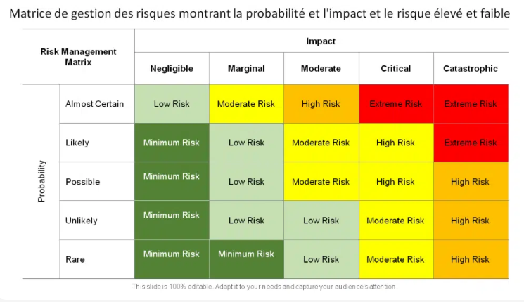
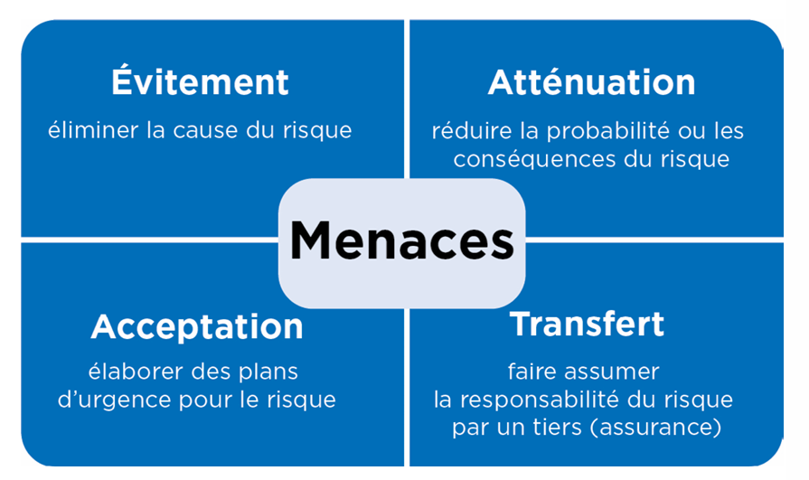

# Les risques

Il existe de nombreux types de risques de sécurité informatique, chacun ayant ses propres caractéristiques et conséquences potentielles. Comprendre ces différents types de risques est essentiel pour mettre en place une stratégie de sécurité efficace.

## Identification des risques

*   La gestion des risques est un processus essentiel pour protéger efficacement vos systèmes d'information. Elle consiste à identifier les risques, à évaluer leur impact potentiel et à mettre en place des mesures de protection appropriées.

*   La première étape consiste à identifier les risques auxquels votre organisation est exposée. Un risque est la combinaison d'une menace et d'une vulnérabilité.
    *   **Menaces :** Les événements ou les actions qui pourraient causer des dommages à vos systèmes d'information (ex : attaques de hackers, erreurs humaines, catastrophes naturelles).
    *   **Vulnérabilités :** Les faiblesses de vos systèmes d'information qui pourraient être exploitées par une menace (ex : logiciels non mis à jour, mots de passe faibles, absence de pare-feu).

### Risque physique

*   **Définition :** Les risques physiques concernent l’accès physique aux équipements informatiques.
*   **Causes possibles :**
  *   Intrusions dans les locaux
  *   Incendies
  *   Inondations
  *   Coupures de courant
*   **Conséquences potentielles :**
  *   Vol ou endommagement du matériel
  *   Indisponibilité des services
  *   Perte de données
*   **Mesures de prévention :**
  *   Contrôle d'accès physique
  *   Systèmes de surveillance
  *   Protection contre les incendies et les inondations
  *   Alimentation de secours

### Risque logiciel

*   **Définition :** Les risques logiciels concernent les logiciels malveillants (malware).
*   **Types de malware :**
  *   Virus
  *   Logiciels espions (spyware)
  *   Rootkits
  *   Ransomware
*   **Conséquences potentielles :**
  *   Endommagement des données ou des systèmes informatiques
  *   Collecte d'informations confidentielles
  *   Prise de contrôle des systèmes
*   **Mesures de prévention :**
  *   Antivirus
  *   Pare-feu
  *   Mises à jour régulières des logiciels
  *   Sensibilisation des utilisateurs

### Risque de configuration

*   **Définition :** Les risques de configuration concernent la mauvaise configuration des systèmes et des applications.
*   **Causes possibles :**
  *   Erreurs de configuration
  *   Paramètres de sécurité par défaut non modifiés
  *   Absence de mises à jour de sécurité
*   **Conséquences potentielles :**
  *   Accès non autorisé aux données ou aux systèmes
  *   Exploitation de vulnérabilités
*   **Mesures de prévention :**
  *   Procédures de configuration standardisées
  *   Audits de sécurité réguliers
  *   Gestion des correctifs

### Risque humain

*   **Définition :** Les risques humains concernent les erreurs commises par les utilisateurs.
*   **Types d'erreurs :**
  *   Divulgation accidentelle d’informations confidentielles
  *   Perte ou vol d’équipements informatiques
  *   Phishing
  *   Mots de passe faibles
*   **Conséquences potentielles :**
  *   Fuite de données
  *   Usurpation d'identité
  *   Compromission des systèmes
*   **Mesures de prévention :**
  *   Formation et sensibilisation des utilisateurs
  *   Politiques de sécurité claires
  *   Authentification multi-facteurs

### Risque de sécurité réseau

*   **Définition :** Les risques de sécurité réseau concernent la sécurité des réseaux informatiques.
*   **Causes possibles :**
  *   Logiciels malveillants
  *   Attaques de type Denial of Service (DoS)
  *   Intrusions
*   **Conséquences potentielles :**
  *   Indisponibilité des services réseau
  *   Vol de données
  *   Compromission des systèmes
*   **Mesures de prévention :**
  *   Pare-feu
  *   Systèmes de détection d'intrusion (IDS)
  *   Segmentation du réseau
  *   Chiffrement des communications

### Risque de sécurité applicative

*   **Définition :** Les risques de sécurité applicative concernent la sécurité des applications.
*   **Causes possibles :**
  *   Vulnérabilités logicielles
  *   Attaques de type SQL Injection
  *   Cross-Site Scripting (XSS)
*   **Conséquences potentielles :**
  *   Vol de données
  *   Manipulation des données
  *   Prise de contrôle des applications
*   **Mesures de prévention :**
  *   Tests de sécurité applicatifs
  *   Développement sécurisé
  *   Validation des entrées
  *   Mises à jour régulières des applications

### Risque de sécurité des données

*   **Définition :** Les risques de sécurité des données concernent la confidentialité, l’intégrité et la disponibilité des données.
*   **Causes possibles :**
  *   Logiciels malveillants
  *   Attaques de type Denial of Service (DoS)
  *   Erreurs humaines
*   **Conséquences potentielles :**
  *   Divulgation d'informations confidentielles
  *   Altération des données
  *   Perte de données
*   **Mesures de prévention :**
  *   Chiffrement des données
  *   Contrôle d'accès
  *   Sauvegardes régulières
  *   Plans de reprise d'activité

### Risque juridique

*   **Définition :** Les risques juridiques concernent les conséquences juridiques de la mauvaise utilisation des données.
*   **Causes possibles :**
  *   Divulgation accidentelle d’informations confidentielles
  *   Non-conformité aux lois sur la protection des données (RGPD, etc.)
  *   Perte ou vol d’équipements informatiques contenant des données personnelles
*   **Conséquences potentielles :**
  *   Sanctions financières
  *   Poursuites judiciaires
  *   Atteinte à la réputation
*   **Mesures de prévention :**
  *   Politiques de confidentialité claires
  *   Formation des employés sur la protection des données
  *   Respect des obligations légales

## Évaluation des risques

*   Une fois les risques identifiés, il est nécessaire d'évaluer leur probabilité d'occurrence et leur impact potentiel sur votre organisation.

    *   **Probabilité :** La chance qu'une menace se réalise en exploitant une vulnérabilité.
    *   **Impact :** Les conséquences négatives d'une réalisation du risque (ex : pertes financières, atteinte à la réputation, interruption de service).

*   L'évaluation des risques permet de prioriser les actions de protection en fonction de leur importance.

## Traitement des risques

*   La dernière étape consiste à mettre en place des mesures de protection pour réduire les risques à un niveau acceptable. Il existe plusieurs options de traitement des risques :

    *   **Évitement :** Éviter les activités ou les situations qui présentent un risque élevé.
    *   **Transfert :** Transférer le risque à un tiers (ex : assurance cyber).
    *   **Atténuation :** Mettre en place des mesures pour réduire la probabilité ou l'impact du risque (ex : installation d'un pare-feu, formation des utilisateurs).
    *   **Acceptation :** Accepter le risque si son coût de traitement est supérieur à son impact potentiel.

Le risque résiduel est le niveau de risque qui subsiste après la mise en œuvre de mesures de sécurité pour atténuer un risque initial. Il représente le risque qu'une organisation accepte de supporter, car éliminer tous les risques est rarement possible ou rentable.

*  Nous pouvons utiliser une échelle de 1 à 3 pour évaluer le niveau de risque résiduel, avec les correspondances suivantes :
  *  1: Faible - Le risque est négligeable et ne nécessite pas d'action supplémentaire immédiate.
  *  2: Moyen - Le risque est acceptable, mais doit être surveillé régulièrement. Des mesures de protection supplémentaires pourraient être envisagées à terme.
  *  3: Fort - Le risque est élevé et nécessite une action immédiate pour le réduire davantage. Des mesures de protection supplémentaires doivent être mises en œuvre dès que possible.

## L'importance de suivre les risques

La gestion des risques n'est pas un projet ponctuel, mais un processus dynamique et continu. 

Il est crucial de surveiller et de réévaluer régulièrement les risques identifiés, l'efficacité des mesures de protection en place et la pertinence de l'analyse des risques.

### Pourquoi un suivi continu ?

1.  **Évolution des Menaces :** Le paysage des menaces est en constante évolution. 
De nouvelles vulnérabilités sont découvertes quotidiennement, et les attaquants développent de nouvelles techniques pour exploiter ces failles. 
Un suivi régulier permet de détecter ces nouvelles menaces et d'adapter les mesures de sécurité en conséquence.

2.  **Changement de l'Environnement de l'Entreprise :** L'environnement d'une entreprise évolue constamment en raison de facteurs tels que :
  *   **Adoption de nouvelles technologies :** L'introduction de nouveaux systèmes, applications ou infrastructures peut introduire de nouveaux risques.
  *   **Évolution des processus métier :** Les changements dans les processus métier peuvent modifier les risques existants ou en créer de nouveaux.
  *   **Croissance de l'entreprise :** L'expansion de l'entreprise peut augmenter la surface d'attaque et exposer l'entreprise à de nouveaux risques.
  *   **Changements réglementaires :** De nouvelles lois et réglementations peuvent avoir un impact sur la gestion des risques de l'entreprise.
  *   **Les outils de l'entreprise :** L'ajout ou le retrait de systèmes ou d'applications.
  *   **L'évolution de l'entreprise :** L'expansion, les fusions et acquisitions.

3.  **Efficacité des Mesures de Sécurité :** Il est essentiel de vérifier régulièrement si les mesures de sécurité mises en place sont toujours efficaces et bien en place. Cela inclut :
  *   **Tests d'intrusion :** Simuler des attaques pour identifier les faiblesses des systèmes et des applications.
  *   **Audits de sécurité :** Évaluer la conformité aux politiques et aux normes de sécurité.
  *   **Analyse des journaux :** Surveiller les événements de sécurité pour détecter les activités suspectes.
  *   **Surveillance continue :** Mettre en place une surveillance continue pour détecter les changements dans l'environnement de risque.

### Comment effectuer un suivi efficace ?

1.  **Réévaluer les Risques :**
  *   Mettre à jour l'analyse des risques à intervalles réguliers (par exemple, tous les trimestres ou tous les ans).
  *   Prendre en compte les nouvelles menaces, les changements dans l'environnement de l'entreprise et les résultats des tests d'intrusion et des audits de sécurité.
  *   Vérifier si la criticité des actifs a changé.

2.  **Mesurer l'Efficacité des Mesures de Sécurité :**
  *   Définir des indicateurs clés de performance (KPI) pour mesurer l'efficacité des mesures de sécurité.
  *   Surveiller régulièrement ces KPI pour identifier les tendances et les problèmes potentiels.
  *   Effectuer des tests réguliers des mesures de sécurité (par exemple, tests de restauration des sauvegardes, tests de continuité d'activité).

3.  **Valider la Pertinence des Mesures :**
  *   S'assurer que les mesures de sécurité sont toujours adaptées aux risques identifiés.
  *   Adapter les mesures de sécurité en fonction des évolutions de l'environnement de risque.
  *   Mettre en place un processus de gestion des exceptions pour traiter les situations où les mesures de sécurité ne peuvent pas être mises en œuvre intégralement.

4.  **Documentation et Communication :**
  *   Documenter toutes les activités de suivi des risques et les résultats obtenus.
  *   Communiquer régulièrement les résultats du suivi des risques aux parties prenantes concernées (direction, équipes de sécurité, etc.).
  *   Mettre en place un processus de remontée d'informations pour signaler les incidents de sécurité et les problèmes potentiels.

