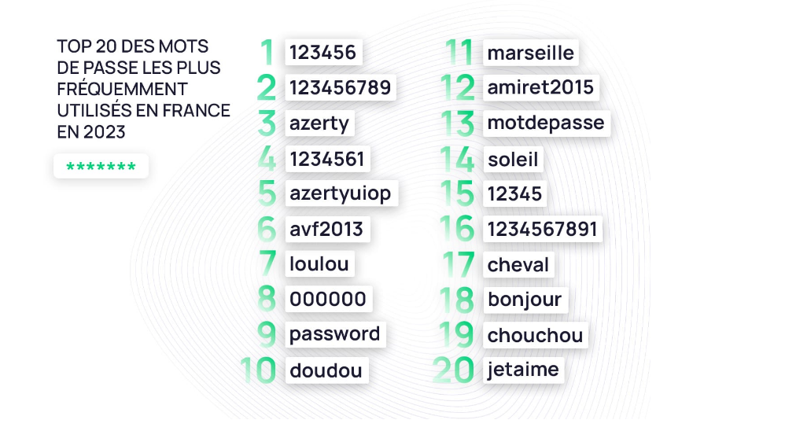
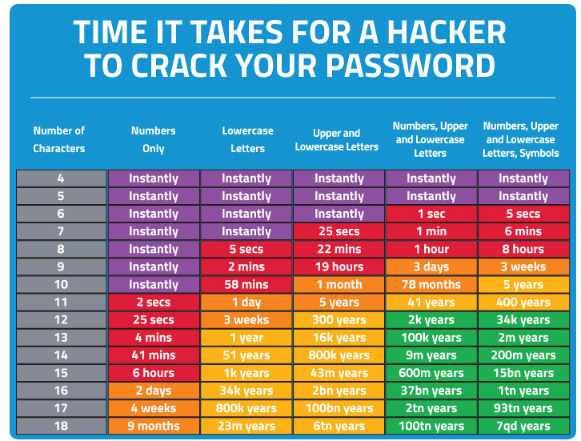
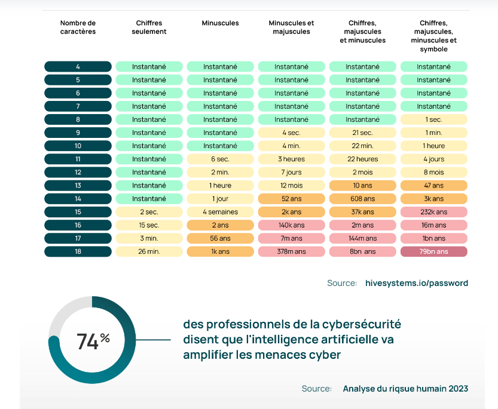

# Gestion des mots de passe

Les mots de passe sont souvent la première ligne de défense pour protéger nos comptes et nos données. Cependant, ils sont aussi l'une des faiblesses les plus exploitées par les attaquants. Ce chapitre explore les problèmes courants liés aux mots de passe et souligne l'importance d'adopter de bonnes pratiques.

*  La gestion des mots de passe représente l’une des principales faiblesses de la sécurité informatique. Un mot de
passe mal choisi, une récupération facile par un tiers peuvent compromettre toute la sécurité d’un système.

*  Les utilisateurs ont besoin d’être identifiés pour accéder à certains services ou applications. Lorsqu’ils se connectent
sur ces ressources, ils doivent fournir leurs noms d’utilisateur et mot de passe (authentification basique) qui est
ensuite envoyée vers un serveur d’authentification pour valider les droits avant que l’accès ne soit autorisé ou
refusé.

*  Les systèmes d’authentification doivent être fiables. La gestion des mots de passe en est une partie importante. Il
existe différents types de gestionnaires de mot de passe :
– Windows Password Vault,
– LastPass,
– KeePassX. . .

## Bonnes et mauvaises habitudes 

*  30 % des utilisateurs en ligne  ont subi une violation de données en raison d’un mot de passe faible.
*  Le  mot de passe le plus courant  est « 123456 ».
*  68 % des personnes  utilisent le même mot de passe sur plusieurs comptes.
*  Près de  la moitié des employés  continuent à utiliser des mots de passe professionnels après avoir quitté une entreprise.
*  Avoir un post-it sur le PC avec le password de session
*  Ranger ses mots de passe dans un carnet, ou bien encore dans un excel
*  Ranger ses mots de passe sur google sheet

Conseils:

*  Un minimum de douze (12) caractères.
*  Une combinaison de lettres minuscules, de lettres majuscules, de chiffres et de caractères spéciaux.
*  Aucune information personnelle.
*  Aucune partie du nom d'utilisateur.
*  Aucun chevauchement avec d’autres mots de passe utilisés sur le lieu de travail ou en dehors.
*  Changer votre mot de passe tous les quatre-vingt-dix (90) jours ou lorsqu’un événement survient qui nécessite un changement de mot de passe.
*  Ne jamais utiliser deux fois le même mot de passe sur deux sites différents

### La force brute

Une attaque par force brute en informatique est une méthode qui consiste à essayer systématiquement toutes les combinaisons possibles de mots de passe ou de clés de chiffrement pour accéder à un système ou à des données protégées

Cette technique repose sur la puissance de calcul pour tester un grand nombre de combinaisons jusqu'à trouver la bonne, ce qui en fait une approche simple mais potentiellement efficace pour les pirates informatiques

Accédez à un outil en ligne tel que [Password Strength Checker](https://www.security.org/how-secure-is-my-password/) pour savoir si mon password est sécurisé.

### Phishing (Souvent utilisé pour voler vos informations de connexion)

*  **Le phishing et l’ingénierie sociale** sont les méthodes favorites des hackers pour se procurer vos informations de connexion. En instillant un sentiment de peur, d’urgence ou en utilisant l’autorité, ils vous manipulent pour vous amener à saisir votre identifiant et votre mot de passe. Ceci fait, ils peuvent les utiliser pour de multiples activités : fraude financière, usurpation d’identité et bourrage d’identifiants.

*  Ne l’oubliez jamais : les techniques de phishing ne se limitent pas aux e-mails. Les cybercriminels se plaisent à utiliser des moyens de communication variés, que ce soit des SMS, des messages apparemment inoffensifs dans les applications de chat, voire des appels téléphoniques.