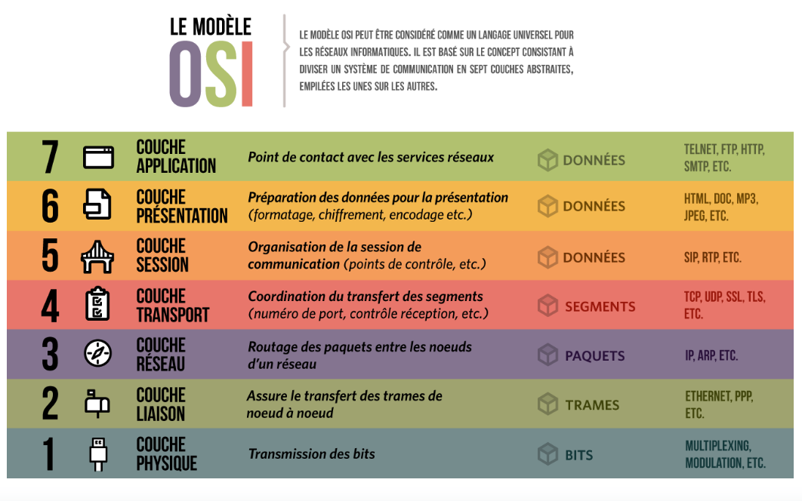

# La sécurité des accès, Pare-feu, WAF, Proxy, NAC

La sécurité des accès est un pilier fondamental de la protection des réseaux et des systèmes d'information. Elle englobe un ensemble de technologies et de pratiques visant à contrôler et à sécuriser l'accès aux ressources

Un pare-feu agit comme une barrière de sécurité entre un réseau interne sécurisé et des réseaux externes potentiellement non sécurisés (comme Internet). Il filtre le trafic réseau selon des règles prédéfinies, permettant ou bloquant certains types de communications.

*  **Caractéristiques principales**
  *  Filtrage du trafic : Examine les paquets de données et décide s'ils doivent être autorisés ou bloqués.
  *  Règles de sécurité : Utilise un ensemble de règles définies par l'administrateur pour déterminer quel trafic est autorisé.
  *  Journalisation : Enregistre les activités du réseau pour analyse et audit.
  *  Protection contre les intrusions : Aide à prévenir les accès non autorisés au réseau.

*  Les différents types de pare-feu 
  *  **Pare-feu matériel :** Un appareil physique dédié à la protection du réseau.
  *  **Pare-feu logiciel :** Un programme installé sur un ordinateur ou un serveur.
  *  **Pare-feu cloud :** Un service de sécurité fourni via le cloud.

Il est possible d'avoir des pare-feu à chaque couche du modèle OSI car chaque couche traite des aspects spécifiques de la communication réseau.

* **Couche 2 (Liaison de données)**
  *  Certains pare-feu peuvent effectuer un filtrage au niveau des adresses MAC. Ces pare-feu de pont fonctionnent sur la couche Liaison et peuvent filtrer le trafic en se basant sur les adresses MAC.

* **Couche 3 (Réseau)**
  *  La plupart des pare-feu opèrent à ce niveau, filtrant le trafic en fonction des adresses IP source et destination. Les pare-feu de couche 3 sont couramment utilisés pour le filtrage de base du trafic réseau.

* **Couche 4 (Transport)**
  *  Presque tous les pare-feu modernes fonctionnent à ce niveau, filtrant le trafic en fonction des ports source et destination, ainsi que des protocoles TCP/UDP. Les pare-feu dynamiques (stateful firewalls) opèrent généralement aux couches 3 et 4.

* **Couches 5-7 (Session, Présentation, Application)**
  *  Certains pare-feu avancés, souvent appelés pare-feu applicatifs (WAF) ou proxys, peuvent analyser et filtrer le trafic jusqu'à la couche application. Ces pare-feu peuvent effectuer des analyses plus approfondies, comme la détection de virus dans les e-mails ou le blocage de certains types de contenu web.

Les pare-feu modernes sont souvent capables d'opérer sur plusieurs couches simultanément

## Pare feu Stetefull et Stateless

*  **Pare-feu stateful (avec état)**

  *  Fonctionne aux couches 3 et 4 du modèle OSI.
  *  Suit l'état des connexions réseau actives.
  *  Conserve une table d'état des connexions.
  *  Inspecte le contenu des paquets pour détecter les menaces.
  *  Peut identifier des attaques complexes utilisant des paquets légitimes.
  *  Plus efficace pour les protocoles comme FTP qui utilisent des connexions dynamiques.
  *  Offre une sécurité renforcée et un contrôle du trafic plus flexible.

*  **Pare-feu stateless (sans état)**

  *  Évalue chaque paquet individuellement, sans conserver d'état.
  *  Utilise des règles prédéfinies basées sur les informations d'en-tête des paquets.
  *  Plus rapide car il n'a pas besoin de maintenir une table d'état.
  *  Moins efficace contre certains types d'attaques complexes.
  *  Ne fait pas la différence entre les types de trafic au niveau applicatif.
  *  Peut être vulnérable aux attaques réparties sur plusieurs paquets.

La principale différence réside dans la capacité du pare-feu stateful à maintenir le contexte des connexions, ce qui lui permet d'offrir une protection plus sophistiquée
Le pare-feu stateless traite chaque paquet de manière isolée, ce qui le rend plus rapide mais potentiellement moins sécurisé pour certains types de menaces

## Les Différents Types de Firewalls

### Pare-feu Personnel (Software Firewall)
Un firewall personnel est un logiciel installé sur un ordinateur individuel pour protéger contre les attaques réseau.

*   **Exemples :** Pare-feu Windows Defender, ZoneAlarm.
*   **Fonctionnement :** Filtre le trafic réseau entrant et sortant en fonction de règles prédéfinies.

### Pare-feu Matériel (Hardware Firewall)
Un firewall matériel est un appareil dédié qui protège un réseau entier contre les attaques.

*   **Exemples :** Cisco ASA, Fortinet FortiGate, Check Point.
*   **Fonctionnement :** Examine le trafic réseau et bloque les connexions non autorisées.

### Web Application Firewall (WAF)
Un WAF (Web Application Firewall) protège les applications web contre les attaques spécifiques au web, telles que les injections SQL, les attaques XSS et les attaques par force brute.

*   **Fonctionnement :** Filtre le trafic HTTP/HTTPS et bloque les requêtes malveillantes.
*   **Exemples :** Cloudflare WAF, AWS WAF, Check Point WAF, Fortinet FortiWeb

## Les règles de filtrage

Les règles de filtrage sont des instructions qui définissent quels types de trafic réseau sont autorisés ou bloqués par un firewall.

### Composants d'une Règle de Filtrage
*   **Source :** L'adresse IP ou le réseau source du trafic.
*   **Destination :** L'adresse IP ou le réseau de destination du trafic.
*   **Port :** Le port de communication utilisé par le trafic (par exemple, 80 pour HTTP, 443 pour HTTPS).
*   **Protocole :** Le protocole de communication utilisé par le trafic (par exemple, TCP, UDP, ICMP).
*   **Action :** L'action à effectuer (autoriser ou bloquer le trafic).

### Ordre des Règles
L'ordre des règles de filtrage est important, car les firewalls traitent les règles de haut en bas et appliquent la première règle qui correspond au trafic.

### Meilleures Pratiques
*   **Règle Implicite de Refus (Implicit Deny) :** Bloquer tout le trafic qui n'est pas explicitement autorisé.
*   **Règles Spécifiques :** Utiliser des règles spécifiques pour autoriser uniquement le trafic nécessaire.
*   **Surveillance :** Surveiller les journaux du firewall pour détecter les tentatives d'accès non autorisées.

## La mise en Œuvre d'une zone démilitarisée (DMZ)

Une zone démilitarisée (DMZ) est une zone réseau isolée qui contient les serveurs et les services qui doivent être accessibles depuis l'Internet, tout en protégeant le réseau interne.

*  **Metaphore** Imagine une maison avec un jardin clôturé.
  *  Le jardin est la DMZ : c'est une zone où les visiteurs (Internet) peuvent venir, mais ils ne peuvent pas entrer directement dans la maison.
  *  La maison est ton réseau interne : elle est protégée et privée.
  *  La clôture représente le pare-feu : elle empêche les visiteurs d'entrer dans la maison tout en leur permettant d'accéder au jardin.

Ainsi, la DMZ (le jardin) permet aux visiteurs d'interagir avec certains services (comme un serveur web), sans compromettre la sécurité de l'intérieur de la maison (le réseau interne).

### Fonctionnement
*   **Firewall :** La DMZ est protégée par un firewall qui contrôle le trafic entrant et sortant.
*   **Accès Limité :** Seuls les ports et les services nécessaires sont autorisés à travers le firewall.
*   **Isolation :** La DMZ est isolée du réseau interne, de sorte que même si un serveur dans la DMZ est compromis, l'attaquant ne peut pas accéder directement au réseau interne.

### Exemples de Services dans la DMZ
*   **Serveurs Web :**
*   **Serveurs de Messagerie :**
*   **Serveurs DNS :**

---

## L'Intégration d'un pare-feu dans le réseau d'entreprise et organisation

### Planification
*   **Analyse des Besoins :** Identifier les besoins de sécurité spécifiques de l'organisation.
*   **Conception de l'Architecture :** Concevoir une architecture réseau qui intègre le pare-feu de manière efficace.

### Configuration
*   **Règles de Filtrage :** Configurer les règles de filtrage pour autoriser uniquement le trafic nécessaire.
*   **DMZ :** Mettre en œuvre une DMZ pour les serveurs accessibles depuis l'Internet.

### Surveillance
*   **Journaux :** Surveiller les journaux d'un pare-feu pour détecter les tentatives d'accès non autorisées.
*   **Alertes :** Configurer des alertes pour être informé des événements suspects.

### Maintenance
*   **Mises à Jour :** Installer les mises à jour du pare-feu.
*   **Tests :** Effectuer des tests réguliers pour vérifier l'efficacité du pare-feu.

**Voir démonstration iptables**