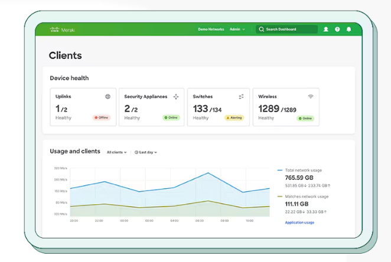

# Réseaux et sécurité

## Gestion du Wi-Fi

Wi-Fi Personnel (Domestique)
Wi-Fi Entreprise

### Configuration sécurisée

#### Paramètres essentiels
* **Nom du réseau (SSID)**
  - ✅ Nom neutre sans indication d'entreprise
  - ❌ Éviter "ComptabiliteParis" ou "DirectionGenerale"

* **Mot de passe**
  - Minimum 12 caractères
  - Mélange majuscules, minuscules, chiffres, caractères spéciaux
  - Exemple : "P@ssw0rd-WiFi-2024!"

* **Chiffrement**
  ```
  Recommandé : WPA3
  Acceptable : WPA2
  À proscrire : WEP, WPA1
  ```

#### Sécurisation avancée

* **Filtrage MAC**
  - Liste blanche d'appareils autorisés
  - Exemple de format : XX:XX:XX:XX:XX:XX
  - Mise à jour régulière de la liste

* **Isolation des clients**
  - Empêche la communication entre appareils
  - Idéal pour réseau invité
  - Protection contre la propagation malware

### Menaces courantes et solutions

#### Evil Twin (Faux point d'accès)
* **Scénario** : Un attaquant crée un point d'accès identique au vôtre
* **Détection** :
  - Surveillance des SSID similaires
  - Analyse des signaux radio
* **Protection** :
  - Certificats clients
  - Formation des utilisateurs

#### Attaque par déauthentification
* **Scénario** : Déconnexion forcée des clients
* **Impact** : Interruption de service
* **Solutions** :
  - WPA3 (Wi-Fi Protected Access 3)(protection native)
  - Détection d'intrusion wireless
  - Géolocalisation des attaques

### Bonnes pratiques de déploiement

#### Cartographie et planification
* **Étude du site**
  - Mesure de la couverture
  - Points d'accès nécessaires
  - Zones sensibles

#### Segmentation réseau
* **Exemple de VLANs**

Un VLAN est un réseau local virtuel qui permet de segmenter logiquement un réseau physique en plusieurs réseaux isolés.

  ```
  VLAN 10 : Administration
  VLAN 20 : Employés
  VLAN 30 : Invités
  VLAN 40 : IoT
  ```

* **Sans VLAN** :
  ```
  Switch
  ├─ PC1 } 
  ├─ PC2 } Tous les appareils peuvent communiquer entre eux
  ├─ PC3 } sur le même réseau physique
  └─ PC4 }
  ```

* **Avec VLANs** :
  ```
  Switch
  ├─ PC1 } VLAN 10 (Administration)
  ├─ PC2 } VLAN 20 (Employés)
  ├─ PC3 } VLAN 30 (Invités)
  └─ PC4 } VLAN 40 (IoT)
  ```
Chaque VLAN est isolé des autres, comme des réseaux physiques séparés

1. **Sécurité**
   * Isolation du trafic entre départements
   * Limitation de la propagation des menaces
   * Contrôle des communications inter-VLAN

2. **Performance**
   * Réduction du trafic broadcast
   * Meilleure gestion de la bande passante
   * Optimisation des flux réseau

3. **Isolation**
   * Chaque VLAN est un domaine de broadcast séparé
   * Le trafic reste confiné dans son VLAN
   * Communication inter-VLAN possible uniquement via un routeur

4. **Contrôle d'accès**
   * Règles de pare-feu entre VLANs
   * Restriction des communications

### Surveillance et maintenance

#### Monitoring quotidien
* **Points de contrôle**
  - Trafic anormal
  - Nouveaux appareils
  - Performance réseau
  - Alertes de sécurité

* **Tableau de bord type**
  ```
  - Nombre de clients connectés
  - Bande passante utilisée
  - Points d'accès actifs
  - Tentatives d'intrusion
  ```
#### Maintenance préventive
* **Planning type**
  ```
  Quotidien : Vérification des logs
  Hebdomadaire : Scan de vulnérabilités
  Mensuel : Mise à jour firmware
  Trimestriel : Audit complet
  ```

#### Exemple d'outils de monitoring

* **Cisco Meraki**
  - Interface web intuitive
  - Visualisation en temps réel
  - Gestion centralisée
  - Prix : À partir de ~150€/an/point d'accès



* **UniFi Network Controller**
  - Gratuit avec matériel Ubiquiti
  - Interface graphique complète
  - Cartes de chaleur
  - Prix : Gratuit (matériel requis)

* **SolarWinds NPM**
  - Monitoring réseau complet
  - Alertes automatiques
  - Rapports détaillés
  - Prix : À partir de ~2500€/an

#### Solutions open source
* **OpenNMS**
  - Gratuit et open source
  - Monitoring complet
  - Nécessite configuration

* **Nagios**
  - Standard de l'industrie
  - Très personnalisable
  - Courbe d'apprentissage importante

### Réponse aux incidents

#### Procédure d'urgence
1. **Détection d'intrusion**
   * Isolation du réseau concerné
   * Capture du trafic suspect
   * Notification équipe sécurité

2. **Compromission confirmée**
   * Révocation des certificats
   * Communication aux utilisateurs
   * Analyse forensique

#### Documentation

* **Éléments à documenter**
  - Nature de l'incident
  - Actions prises
  - Impact sur le service
  - Mesures correctives

## Les VPN (Réseaux Privés Virtuels)

### VPN Site à Site

#### Cas d'utilisation concrets
1. **Entreprise multi-sites**
   * Scénario : Une entreprise avec un siège social à Paris et des bureaux à Lyon et Marseille
   * Besoin : Partage sécurisé des ressources (fichiers, applications, imprimantes)
   * Solution : VPN site à site reliant les trois sites

2. **Usine de production**
   * Scénario : Site de production délocalisé devant accéder aux serveurs centraux
   * Besoin : Transmission sécurisée des données de production
   * Solution : Tunnel VPN permanent entre l'usine et le siège

#### Mise en place
1. **Équipements nécessaires**
   * Routeurs compatibles VPN aux deux extrémités
   * Connexion Internet stable avec IP fixe
   * Pare-feu configurés pour le trafic VPN

2. **Configuration type**
   ```
   Site A (Paris)          Site B (Lyon)
   192.168.1.0/24         192.168.2.0/24
   ┌─────────────┐        ┌─────────────┐
   │ LAN Paris   │◄─────►│ LAN Lyon    │
   └─────────────┘        └─────────────┘
   Tunnel IPsec sur Internet
   ```

3. **Étapes de configuration**
   * Définition des réseaux locaux autorisés
   * Configuration des règles de routage
   * Mise en place des certificats ou clés partagées

Failles potentielles et solutions

1. **Interruption de connexion**
   * Risque : Perte de la connexion VPN
   * Solution : Connexion Internet redondante
   * Exemple : Ligne principale fibre + backup 4G

2. **Compromission des clés**
   * Risque : Vol des certificats ou clés
   * Solution : Rotation régulière des clés
   * Mise en place : Renouvellement automatique tous les 90 jours

3. **Attaque Man-in-the-Middle**
   * Risque : Interception du trafic
   * Solution : Certificats signés et validation stricte
   * Vérification : Empreintes des certificats


### VPN Nomade

#### Scénarios d'utilisation

1. **Télétravail**
   * Contexte : Employés travaillant depuis leur domicile
   * Besoins : 
     - Accès aux applications internes
     - Partage de fichiers sécurisé
     - Téléphonie IP d'entreprise
   * Solution : Client VPN avec authentification forte

2. **Commercial en déplacement**
   * Contexte : Force de vente mobile
   * Besoins :
     - Accès base clients
     - Système de commandes
     - Emails sécurisés
   * Solution : VPN sur smartphone/laptop

#### Configuration sécurisée

1. **Authentification**
   ```
   Utilisateur ──► Mot de passe
                  + Token 2FA
                  + Certificat client
   ```

2. **Restrictions d'accès**
   * Par groupe d'utilisateurs
   * Par plage horaire
   * Par type d'appareil
   * Par localisation

3. **Exemple de politique**
   ```
   Groupe: Commercial
   - Accès: 7h-21h
   - Applications autorisées: CRM, Email, Intranet
   - Appareils: Portable professionnel uniquement
   - 2FA obligatoire
   ```

#### Mesures de sécurité spécifiques

1. **Avant connexion**
   * Vérification de l'antivirus à jour
   * Scan de conformité de l'appareil
   * Validation du patch level
   * Vérification du certificat client

2. **Pendant la session**
   * Surveillance du trafic
   * Détection d'anomalies
   * Limitation de bande passante
   * Journalisation des accès

3. **Politique de sécurité**
   * Déconnexion automatique après inactivité
   * Blocage du copier-coller (optionnel)
   * Effacement à distance possible

#### Réponse aux incidents

1. **Compromission détectée**
   * Révocation immédiate du certificat
   * Blocage du compte concerné
   * Analyse des logs de connexion
   * Rapport d'incident

2. **Perte d'appareil**
   * Révocation des accès VPN
   * Effacement à distance si possible
   * Changement des mots de passe
   * Vérification des derniers accès

#### Bonnes pratiques de maintenance

1. **Surveillance quotidienne**
   * Monitoring des connexions
   * Vérification des logs
   * Contrôle de la bande passante
   * Détection des anomalies

2. **Maintenance régulière**
   * Mise à jour des clients VPN
   * Renouvellement des certificats
   * Test des procédures de secours
   * Revue des accès utilisateurs


