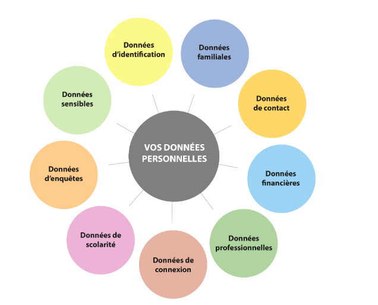
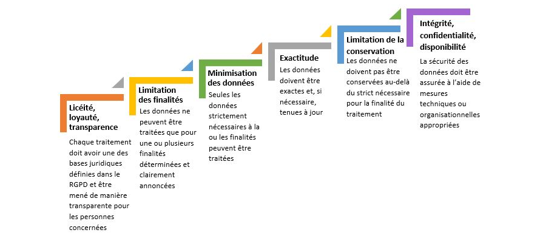
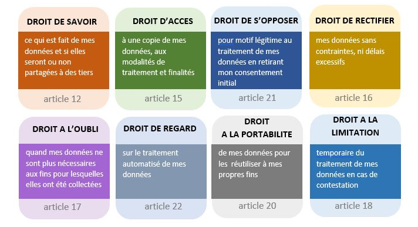

# Le RGPD, une bonne défense. 

## Règlement Général sur la Protection des Données (RGPD)

Le RGPD (ou GDPR en anglais) est le texte de référence qui encadre le traitement des données personnelles sur tout le territoire de l’Union Européenne. Composé de 99 articles, ses 173 considérants de principe détaillent la nouvelle législation. Conçu pour harmoniser le cadre juridique européen, il donne notamment davantage de contrôle aux individus sur leurs données personnelles.

Toutes les entreprises, organismes publics et associations, des États membres de l'UE, qui collectent et/ou traitent des informations sur les résidents européens, sont concernés. L’Université de Lorraine y est donc assujettie de fait.

Le règlement européen ouvre des droits supplémentaires aux personnes pour protéger leur vie privée et de nouveaux devoirs aux responsables de traitement qui recueillent et utilisent ces données.

**Le RGPD** s’inscrit dans la dynamique et la **continuité des règlementations précédentes**, qu'elles soient européennes ou françaises :

*  La Loi française Informatique et Libertés du 6 janvier 1978 modifiée par le décret n° 2019-536 du 30 juin 2019 (LIL)
*  La Directive européenne 95/46 « Protection des données personnelles »
*  Le Paquet Telecom
*  La Loi pour la Confiance dans l’Economie Numérique (LCE)
*  La Loi pour une République numérique (dite Loi Lemaire)

## Le RGPD: Un allié de poids pour la cybersécurité

*  **Renforcement de la sécurité des données:** Le RGPD impose aux organisations de mettre en place des mesures de sécurité techniques et organisationnelles appropriées pour protéger les données personnelles. Cela se traduit concrètement par :
  *  Chiffrement des données
  *  Contrôle d'accès strict
  *  Sécurisation des infrastructures
*  **Gestion proactive des risques:** Le RGPD encourage les entreprises à réaliser des analyses d'impact sur la protection des données (AIPD) pour identifier et évaluer les risques liés au traitement des données personnelles. Cela permet d'anticiper les menaces et de mettre en place des mesures préventives.
*  **Responsabilisation des acteurs:** Le RGPD responsabilise les organisations en les obligeant à rendre compte de la manière dont elles traitent les données personnelles. Cela favorise une culture de la sécurité et de la protection des données au sein de l'entreprise.
*  **Notification des violations de données:** Le RGPD impose aux organisations de notifier les violations de données personnelles aux autorités de contrôle et aux personnes concernées. Cela permet de réagir rapidement en cas d'incident et de limiter les dommages.
*  **Droit à l'information et à la transparence:** Le RGPD garantit aux individus le droit d'être informés sur la manière dont leurs données sont traitées. Cela favorise la confiance et encourage les entreprises à adopter des pratiques transparentes en matière de sécurité des données.
*  **Sanctions dissuasives:** Les sanctions financières prévues par le RGPD (jusqu'à 4% du chiffre d'affaires annuel mondial) incitent les organisations à prendre la sécurité des données au sérieux et à investir dans des mesures de protection efficaces.


### Données personnelles

Le RGPD définit comme donnée personnelle, toute information qui permet d’identifier directement ou indirectement une personne physique. Le champ des possibles est très large. Il peut s’agir du nom et du prénom d’un individu, mais aussi de son identifiant, du numéro de sa plaque d’immatriculation, de son adresse ip ou même encore de sa voix. L’identification peut être réalisée à partir d’une seule information ou par recoupement de plusieurs.

Certaines données sont qualifiées de « sensibles ». C’est le cas, par exemple, des informations qui ont trait à l’origine ethnique, aux opinions politiques, aux convictions religieuses ou philosophiques, à la santé, … Le règlement européen interdit leur traitement sauf dans le cas d’exceptions clairement identifiées.

### Type de données: 

*  Données d’identification (nom, prénom, photo, âge, numéro de sécurité sociale, lieu de naissance...)
*  Données de situation familiale (situation matrimoniale, nombre d’enfants, …)
*  Données de contacts (téléphone, adresse, courriel, …)
*  Données financières (avis d’imposition, relevé bancaire, …)
*  Données professionnelles (profession, cv, …)
*  Données de connexions (adresse IP de votre ordinateur, nombre de logs, …)
*  Données de scolarité (diplômes, notes, candidatures, …)
*  Données d’enquêtes (avis, commentaires, appréciation, …)



### Traitement des données collectées

Nous devons traiter les données collectées dans le strict respect de la règlementation et pour les seuls besoins du fonctionnement de ses services ou de son organisation et de l’accomplissement de ses missions.

A titre d’exemples, ci-dessous les traitements les plus fréquents :

*  Traitement pour la gestion des comptes informatiques
*  Traitement pour la gestion administrative
*  Traitement pour la constitution de listes de diffusion
*  Traitement pour la mise à disposition de services numériques
*  Traitement à des fins de gestion de la vie étudiante ou du personnel

Obligations liées au traitement des données:



### Droit sur mes données




### Cartographie: 

Chaque traitement de données nécessite des outils spécifiques (supports) pour atteindre son objectif. 

Il est crucial de comprendre cette chaîne complète pour :
- Identifier où se trouvent les données
- Savoir comment elles sont utilisées
- Contrôler leur cycle de vie
- Gérer les risques associés

Les éléments à analyser pour chaque traitement

* **Finalité**
  - Quel est l'objectif du traitement ?
  - Est-il nécessaire et proportionné ?

* **Supports utilisés**
  - Quels outils sont nécessaires ?
  - Comment interagissent-ils entre eux ?

* **Données concernées**
  - Quelles données sont traitées ? Perso/Pro ?
  - Quelle est leur sensibilité ?
  - Combien de temps les conserver ?

* **Personnes Concernées**
  - Quels sont les personnes concernées ? 
  - L'impact sur les personnes concernées ?

* **Parties prenantes**
  - Quelles sont les parties prenantes ? (Partenaire, freelance..)
  - Il y a t'il un risque pour les parties prenantes? 

* **Risques associés**
  - Quels sont les dangers ?
  - Quels impacts en cas de problème ?

**Importance de la démarche**

**Conformité légale**
- Respect du RGPD
- Traçabilité des données
- Justification des durées de conservation

**Sécurité**
- Protection adaptée au risque
- Mesures proportionnées
- Prévention des incidents

**Efficacité opérationnelle**
- Optimisation des outils
- Rationalisation des accès
- Meilleure gestion des ressources

### Méthodologie d'analyse

1. **Identifier le traitement**
   - Son but
   - Ses acteurs
   - Son périmètre

2. **Cartographier les supports**
   - Outils principaux
   - Outils secondaires
   - Interactions entre outils

3. **Analyser les données**
   - Types de données
   - Flux de données
   - Durées de conservation

4. **Évaluer les risques**
   - Par support
   - Par type de donnée
   - Par flux d'information

5. **Définir les mesures**
   - Techniques
   - Organisationnelles
   - De contrôle

## Définition du droit d'accès

### Principe fondamental
Le droit d'accès permet à toute personne d'obtenir :
- La confirmation que ses données sont traitées
- L'accès à ses données personnelles
- Des informations sur le traitement
- Une copie des données détenues

### Délai légal
- 1 mois maximum pour répondre
- Extension possible de 2 mois si demande complexe
- Obligation d'informer de l'extension dans le mois

## Informations à fournir

### 1. Sur le traitement
- Finalités du traitement
- Catégories de données traitées
- Destinataires des données
- Durée de conservation prévue
- Source des données (si non collectées directement)

### 2. Sur les droits
- Droit de rectification
- Droit d'effacement
- Droit à la limitation
- Droit d'opposition
- Droit à la portabilité

## Modalités d'exercice

### 1. Demande d'accès
* **Qui peut demander ?**
  - La personne concernée, un client, un partenaire..
  - Son représentant légal
  - Un mandataire autorisé

* **Comment demander ?**
  - Par écrit (email, courrier)
  - Via un formulaire dédié
  - Sur place avec justificatif

### 2. Vérification d'identité
* **Documents acceptés**
  - Carte d'identité
  - Passeport
  - Autre document officiel

* **Pourquoi vérifier ?**
  - Éviter les fuites de données
  - Protéger la vie privée
  - Obligation légale

## Limites et exceptions

### 1. Demandes abusives
* **Caractéristiques**
  - Répétitives sans motif
  - Volume excessif
  - Intention de nuire

* **Réponses possibles**
  - Refus motivé
  - Demande de justification

### 2. Restrictions légales
- Secret professionnel
- Propriété intellectuelle
- Droits des tiers
- Sécurité nationale

## Bonnes pratiques

### 1. Pour l'entreprise
* **Organisation**
  - Procédure claire
  - Formulaire type
  - Formation du personnel
  - Registre des demandes

* **Technique**
  - Système de suivi
  - Modèles de réponse
  - Base de données centralisée
  - Outils d'extraction

### 2. Pour la réponse
* **Format**
  - Clair et compréhensible
  - Langage simple
  - Structure logique
  - Format demandé si possible

* **Contenu**
  - Exhaustif
  - Précis
  - Vérifié
  - Documenté

## Exemple de processus

**1. Réception demande**
```
Jour 1 : 
- Réception demande
- Accusé réception
- Vérification identité
```

**2. Traitement**
```
Semaine 1-2 :
- Collecte des données
- Vérification exhaustivité
- Préparation réponse
```

**3. Réponse**
```
Avant 1 mois :
- Envoi réponse
- Archivage de la réponse
```

**Sanctions possibles**

**Non-respect du droit d'accès**
- Mise en demeure CNIL
- Amende administrative
- **Jusqu'à 4% du CA mondial**
- Ou 20 millions d'euros


## ISO 29100 Privacy Framework (Cadre pour la gestion des données personnelle)

L'ISO 29100, également connu sous le nom de *Privacy Framework*, est une norme internationale publiée pour la première fois en **2011** et mise à jour en **2018**. 
Elle fournit un cadre conceptuel pour protéger les informations personnelles identifiables (PII) dans les systèmes d'information et de communication. 

### Objectifs de l'ISO 29100

1. **Fournir une terminologie commune :** Définir des termes standards liés à la confidentialité pour une meilleure compréhension et cohérence.
2. **Décrire les rôles des acteurs :** Identifier les responsabilités des différentes parties impliquées dans le traitement des PII (ex. : responsables de traitement, sous-traitants, etc.).
3. **Établir des principes de confidentialité :** Proposer **11 principes fondamentaux** pour guider la gestion des PII.
4. **Protéger la vie privée :** Aider les organisations à concevoir, mettre en œuvre et maintenir des systèmes qui respectent la vie privée.

## Les 11 Principes Fondamentaux de l'ISO 29100

1. **Consentement et choix :** Obtenir le consentement explicite des individus avant de collecter ou traiter leurs données.
2. **Légitimité et spécification du but :** Collecter des données uniquement pour des finalités légitimes, explicites et spécifiques.
3. **Limitation de la collecte :** Réduire la collecte de données au strict nécessaire.
4. **Minimisation des données :** Limiter les données collectées et conservées à ce qui est essentiel.
5. **Limitation de l'utilisation, de la conservation et de la divulgation :** Éviter l'utilisation ou le partage des données au-delà des finalités initiales.
6. **Exactitude et qualité :** Maintenir les données exactes et à jour.
7. **Ouverture, transparence et notification :** Informer clairement les individus sur la manière dont leurs données sont utilisées.
8. **Participation individuelle et accès :** Permettre aux individus d'accéder à leurs données, de les corriger ou de demander leur suppression.
9. **Responsabilité :** S'assurer que toutes les parties respectent les principes de confidentialité.
10. **Sécurité de l'information :** Protéger les données contre tout accès non autorisé ou perte grâce à des mesures techniques et organisationnelles.
11. **Conformité à la confidentialité :** Respecter toutes les lois, réglementations et politiques applicables en matière de confidentialité.

### Mise en Œuvre

Pour appliquer l'ISO 29100, une organisation doit :

1. Évaluer ses besoins en confidentialité :
- Identifier les PII traitées.
- Évaluer les risques associés au traitement des PII.

2. Développer une politique de confidentialité:
- Définir des objectifs clairs en matière de protection des données.
- Mettre en place des procédures pour répondre aux demandes d'accès ou gérer les violations.

3. Mettre en œuvre des contrôles de confidentialité :
- **Techniques :** Exemples : chiffrement, contrôle d'accès.
- **Administratifs :** Exemples : formation du personnel.
- **Physiques :** Exemples : stockage sécurisé.

4. Surveiller et améliorer continuellement :
- Effectuer régulièrement des audits pour garantir le respect des principes.
- Mettre à jour les politiques en fonction des nouvelles menaces ou réglementations.

### Avantages pour une Organisation

1. **Amélioration de la confiance :** Renforce la réputation d'une organisation auprès de ses clients et partenaires.
2. **Réduction des risques juridiques :** Aide à se conformer aux lois sur la protection des données comme le RGPD ou le CCPA.
3. **Prévention des violations de données :** Réduit le risque d'incidents grâce à une gestion proactive.

## RGPD vs. ISO/IEC 29100 : Principales Différences

| Caractéristique      | RGPD (Règlement Général sur la Protection des Données) | ISO/IEC 29100 (Privacy Framework)                 |
| -------------------- | ------------------------------------------------------ | -------------------------------------------------- |
| **Nature**           | Règlementation juridique (Loi)                        | Norme internationale volontaire                    |
| **Caractère**        | Obligatoire                                           | Non obligatoire                                    |
| **Portée Géographique** | Union Européenne (et organisations traitant des données de citoyens européens) | Mondiale                                           |
| **Objectif Principal** | Protéger les droits et les données personnelles des individus | Fournir un cadre pour la gestion de la confidentialité des PII |
| **Orientation**       | Droits des personnes, conformité légale              | Best practices, mise en œuvre de contrôles de confidentialité |
| **Contenu**          | Articles de loi, définitions de droits et obligations | Principes, rôles, responsabilités, lignes directrices |
| **Mesures**          | Consentement, minimisation, sécurité, notification, etc. | Cadre conceptuel pour définir et implémenter les mesures |
| **Sanctions**         | Amendes importantes (jusqu'à 20 millions d'euros ou 4% du CA) | Aucune sanction directe (mais peut influencer la réputation) |
| **Implémentation**   | Exigence légale, audit de conformité                | Adoption volontaire, démonstration de bonnes pratiques |
| **Relation**         | L'ISO/IEC 29100 peut être utilisée pour aider à la conformité au RGPD | Le RGPD peut inciter à adopter l'ISO/IEC 29100    |

**Résumé :** Le RGPD est la loi et l'IS 29100 est un guide pour appliquer les principes de la loi.


