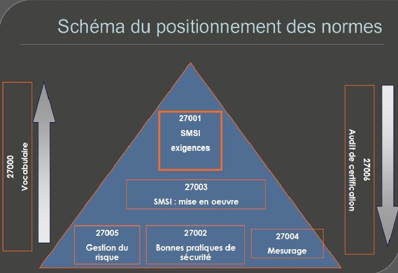
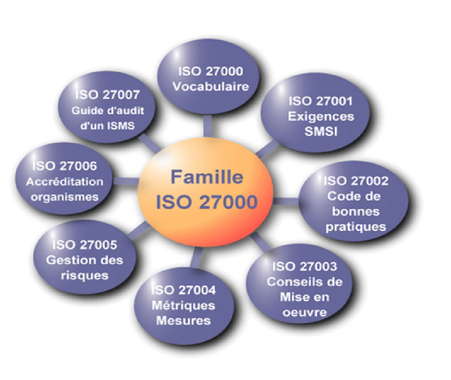

# Famille des normes ISO 27000

## Les normes ISO 27000

*  **ISO 27001 (2013)**
  *  Systèmes de management de la sécurité de l’information - Exigences
*  **ISO27002 (2013)**
  *  Code de bonne pratique pour la gestion de la sécurité de
l’information
*  **ISO27003 (2010)**
  *  Lignes directrices pour la mise en œuvre du système de
management de la sécurité de l’information
*  **ISO27004 (2009)**
  *  Management de la sécurité de l ’information – Mesurage
*  **ISO27005 (2011)**
  *  Gestion des risques liés à la sécurité de l’information
*  **ISO27006 (2011)**
  *  Exigences pour les organismes procédant à l’audit et à la certification
des systèmes de management de la sécurité de l’information

## ISO 27001 (Systèmes de management de la sécurité de l'information (SMSI))

### Qu'est-ce que la norme ISO 27001 ?

La norme **ISO/IEC 27001** est une référence internationale pour les systèmes de management de la sécurité de l'information (SMSI). Elle aide les organisations à protéger leurs données sensibles et à garantir la confidentialité, l'intégrité et la disponibilité des informations.

### Objectifs principaux

1. **Confidentialité** : Garantir que seules les personnes autorisées ont accès aux informations sensibles.
2. **Intégrité** : Assurer l'exactitude et l'exhaustivité des informations.
3. **Disponibilité** : Veiller à ce que les informations soient accessibles aux utilisateurs autorisés quand cela est nécessaire.

### Processus de certification

Pour obtenir la certification ISO 27001, une organisation doit suivre plusieurs étapes :

1. **Définition du périmètre** : Identifier les actifs et systèmes concernés par le SI.
2. **Analyse des risques** : Évaluer les menaces potentielles et leur impact.
3. **Mise en place des contrôles** : Implémenter des mesures pour réduire les risques identifiés.
4. **Audits internes et externes** : Vérifier la conformité aux exigences de la norme.
5. **Amélioration continue** : Assurer une surveillance régulière et une mise à jour des processus.

*  La norme impose la création et le maintien de plusieurs documents clés pour prouver la conformité. Voici les principaux documents requis ([source](https://blog.netwrix.fr/2021/02/05/conformite-iso-27001/)) :
  *  **Domaine d’application du SMSI** (clause 4.3) : Définir précisément les systèmes et processus couverts par le SMSI. (Le Système de management de la sécurité de l'information (SMSI))
  *  **Politique de sécurité de l’information** (clause 5.2) : Élaborer une politique claire concernant la gestion des informations.
  *  **Objectifs de sécurité de l’information** (clause 6.2) : Fixer des objectifs mesurables pour améliorer la sécurité.
  *  **Résultats de l’évaluation des risques** (clause 8.2) : Identifier et analyser les risques liés à l’information.
  *  **Programme d’audit interne du SMSI** (clause 9.2) : Planifier et documenter les audits internes réguliers.
  *  **Preuves des actions correctives engagées** (clause 10.1) : Documenter les non-conformités identifiées et les mesures prises pour y remédier.

*  **Les entreprises doivent :**
  *  Identifier tous les actifs informationnels critiques (données, systèmes, infrastructures).
  *  Effectuer une analyse des risques liés à ces actifs (perte, vol, altération).
  *  Mettre en place des mesures adaptées pour réduire ces risques.

*  Certaines industries ou secteurs imposent des obligations spécifiques liées à ISO 27001 :
  *  **Secteur financier** : Les entreprises doivent se conformer au règlement DORA (Digital Operational Resilience Act) dès janvier 2025.
  *  **Secteur santé** : Respecter les réglementations locales sur la protection des données médicales sensibles.
  *  **Secteur technologique** : Garantir la conformité avec le RGPD ou équivalents internationaux (exemple : CCPA en Californie).

*  Pour obtenir et maintenir la certification ISO 27001 :
  *  Les entreprises doivent réaliser des audits internes réguliers pour vérifier la conformité du SMSI.
  *  Elles doivent passer un audit externe réalisé par un organisme certificateur agréé.
  *  Des audits annuels de suivi sont nécessaires pour conserver la certification sur un cycle de trois ans.

### Avantages de la certification

*  En plus d'être une obligation dans certains secteurs, adopter ISO 27001 offre plusieurs bénéfices :
  *  **Réduction des risques juridiques** grâce à une conformité stricte avec les lois en vigueur.
  *  **Avantage concurrentiel**, notamment dans les appels d'offres où la certification est souvent exigée.
  *  **Amélioration continue** grâce aux audits réguliers et aux plans d'action correctifs.

## ISO 27002 (Bonnes pratiques de sécurité)

*  Norme internationale 27002 (2013) concernant la sécurité de
l’information :
  *  Code de bonnes pratiques pour la gestion de la sécurité de l’information
  *  Destinée à être utilisée par tous ceux qui sont responsables de
    la mise en place ou du maintien d’un Système de Management
    de la Sécurité de l’information (SMSI)
  *  Norme sans caractère obligatoire

*  Norme qui se compose de : 
  *  14 chapitres
  *  35 thèmes de sécurité
  *  114 mesures (bonnes pratiques)

### Bonne pratique ISO 27002

- A.5 Politiques de sécurité de l’information
- A.6 Organisation de la sécurité de l’information
- A.7 La sécurité des ressources humaines
- A.8 Gestion des actifs
- A.9 Contrôle d’accès
- A.10 Cryptographie
- A.11 Sécurité physique et environnementale
- A.12 Sécurité liée à l’exploitation
- A.13 Sécurité des communications
- A.14 Acquisition, développement et maintenance des systèmes
d’information
- A.15 Relations avec les fournisseurs
- A.16 Gestion des incidents liés à la sécurité de l’information
- A.17 Aspects de la sécurité de l’information dans la gestion de
la continuité de l’activité
- A.18 Conformité

