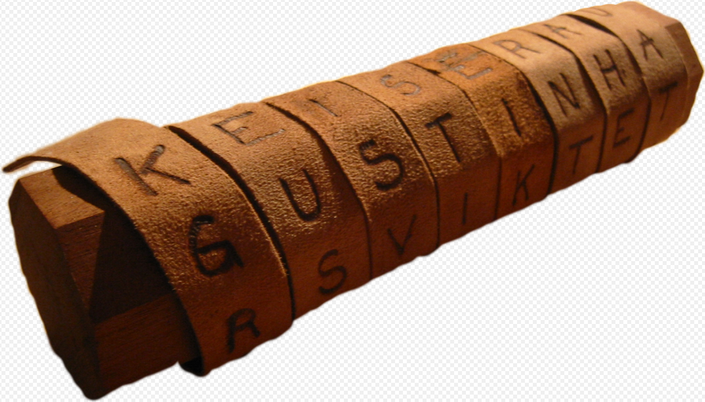
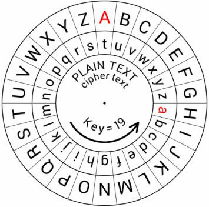
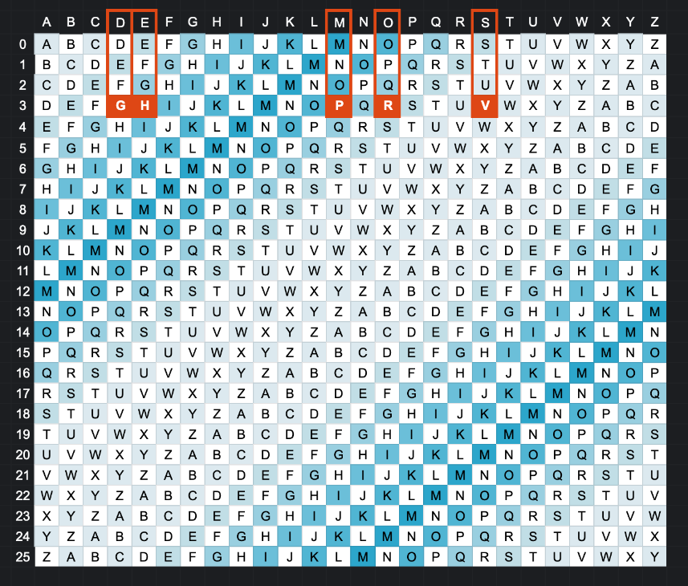
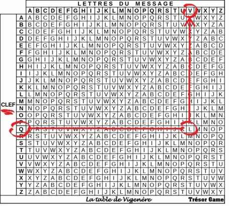
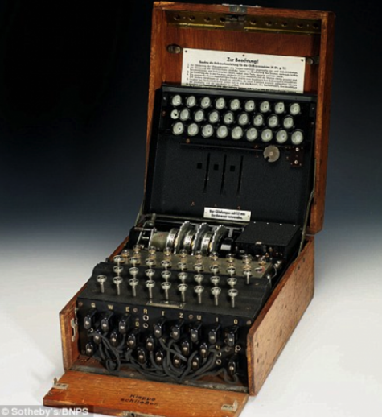
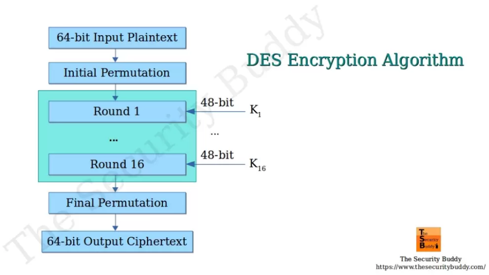
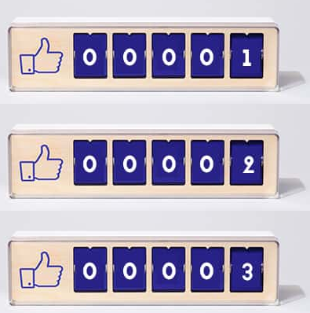
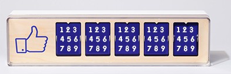
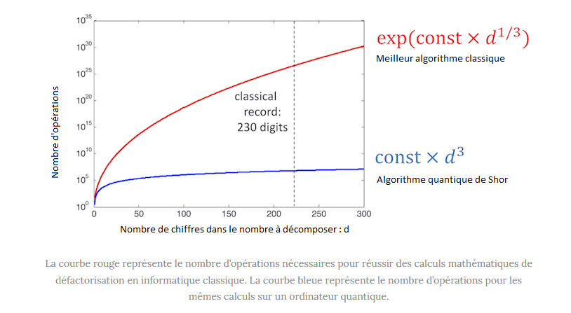

# Histoire de la Cryptographie

## Introduction

La cryptographie, l'art et la science du secret.

Une histoire riche et fascinante qui s'étend sur des milliers d'années. 

Des méthodes simples de substitution utilisées dans l'Antiquité aux algorithmes complexes utilisés aujourd'hui.

la cryptographie a joué un rôle essentiel dans la protection des communications militaires, diplomatiques et commerciales. 

---

## L'Antiquité

### Cryptographie Rudimentaire
Les premières formes de cryptographie remontent à l'Antiquité, où des méthodes simples de substitution et de transposition étaient utilisées pour masquer les messages.

*   **Égypte Ancienne :** Des hiéroglyphes non standard étaient utilisés dans certaines inscriptions pour masquer le sens des messages.
*   **Grèce Antique :** La scytale spartiate, une technique de chiffrement par transposition, était utilisée pour chiffrer les messages militaires. Un message était écrit sur une bande de parchemin enroulée autour d'un bâton d'un certain diamètre. Seul quelqu'un possédant un bâton de diamètre identique pouvait lire le message.

On enroulait en hélice une bande de cuir autour de la scytale avant d'y inscrire un message. Une fois déroulé, le message était envoyé au destinataire qui possédait un bâton identique, nécessaire au déchiffrement.

### Chiffre de César

Jules César utilisait un simple chiffre de substitution pour protéger ses communications militaires. 
Chaque lettre du message était remplacée par une lettre située un certain nombre de positions plus loin dans l'alphabet.

*  **Exemple :** 
  *  Avec un décalage de 3, la lettre A devient D, B devient E, et ainsi de suite.
  *  Avec un décalage de 19, la lettre A devient T, B devient U, et ainsi de suite.

Le mot « DEMOS » chiffré (avec 3) avec un code César donne « GHPRV ».

Le décalage doit être connu du destinataire, c’est ce qu’on appelle la clé. 

Le décalage sera constant pour la totalité du message, contrairement au code César Progressif ou au code Vigenere. 

C’est ce qui fait sa faiblesse, il est facile à détecter et à déchiffrer.

## Le Moyen Âge

### Cryptographie Arabe

Les mathématiciens arabes ont apporté des contributions significatives à la cryptographie, notamment en développant des méthodes pour casser les chiffres de substitution simples par analyse de fréquence.

**Al-Kindi :** Mathématicien, a écrit un traité sur le déchiffrement des messages chiffrés, inventant ainsi l'analyse de fréquence.

L'analyse de fréquence est une technique de cryptanalyse qui consiste à étudier la fréquence d'apparition des lettres ou des groupes de lettres dans un texte chiffré pour déduire des informations sur le texte clair.

Elle repose sur le fait que certaines lettres (comme le "E" en français) apparaissent plus fréquemment que d'autres, et que cette distribution de fréquence se conserve, même après un chiffrement simple par substitution.

En comparant les fréquences observées dans le texte chiffré avec les fréquences connues dans la langue d'origine, il est possible de déchiffrer le message.

## La Renaissance et l'Ère Moderne

Au 15e siècle, Leon Battista Alberti a inventé les chiffres polyalphabétiques, qui utilisent plusieurs alphabets de substitution pour rendre l'analyse de fréquence plus difficile:

### Chiffre de Vigenère

Blaise de Vigenère a perfectionné le chiffre polyalphabétique, créant un chiffre réputé incassable pendant plusieurs siècles. Le chiffre de Vigenère utilise une clé répétée pour déterminer l'alphabet de substitution à utiliser pour chaque lettre du message.

Le chiffre de Vigenère est plus sûr qu'un simple remplacement de lettres (comme le chiffre de César) parce qu'il utilise plusieurs alphabets, ce qui rend l'analyse de fréquences beaucoup plus difficile. Cependant, il n'est pas incassable, surtout si le mot-clé est court ou facile à deviner.

**Fonctionnement**

Tu choisis un **mot-clé** : Par exemple, "CLE". Ce mot-clé va déterminer les alphabets que tu vas utiliser
Tu écris ton **message** : Par exemple, "ATTAQUE".

Tu répètes ton mot-clé sous ton message:

ATTAQUE

CLECLEC

Tu utilises une **table de Vigenère** (ou tu peux la reconstituer) : Cette table est un tableau où la première ligne et la première colonne sont l'alphabet. Imagine un tableau avec l'alphabet écrit en haut et sur le côté.

Pour **chiffrer chaque lettre** de ton message, tu regardes :

*   La **lettre du message** (par exemple, le premier "A" de "ATTAQUE").
*   La **lettre correspondante de ton mot-clé** (le premier "C" de "CLECLEC").
*   L'**intersection de cette ligne et de cette colonne** dans ta table te donne la lettre chiffrée. Dans ce cas, l'intersection de la ligne "C" et la colonne "A" donne "C".

Tu répètes l'opération pour chaque lettre :

*   A (message) + C (clé) = **C (chiffré)**
*   T (message) + L (clé) = **E (chiffré)**
*   T (message) + E (clé) = **X (chiffré)**
*   A (message) + C (clé) = **C (chiffré)**
*   Q (message) + L (clé) = **B (chiffré)**
*   U (message) + E (clé) = **Y (chiffré)**
*   E (message) + C (clé) = **G (chiffré)**

Donc "ATTAQUE" devient "**CEXCBYG**".

### Cryptographie Militaire et Diplomatique

La cryptographie est devenue un outil essentiel pour les communications militaires et diplomatiques. Des bureaux de chiffre se sont développés dans les gouvernements pour créer et casser les codes.

## L'Ère de l'Électricité et de l'Électronique

### Machine Enigma

La machine Enigma, utilisée par l'Allemagne pendant la Seconde Guerre mondiale, est un exemple célèbre de cryptographie mécanique. Elle utilisait des rotors et des tableaux de connexion pour chiffrer les messages.

**Défis :** Le déchiffrement de la machine Enigma par les Alliés, notamment grâce aux travaux d'Alan Turing, a eu un impact significatif sur le cours de la guerre.

### Cryptographie Électronique

Avec l'avènement des ordinateurs, la cryptographie est devenue plus complexe et plus sophistiquée. Des algorithmes de chiffrement plus puissants ont été développés.

### Cryptographie à Clé Secrète (Symétrique)

Le développement d'algorithmes comme DES (Data Encryption Standard) dans les années 1970 a marqué une étape importante. DES a été largement utilisé, mais sa clé relativement courte (56 bits) l'a rendu vulnérable aux attaques par force brute.

D'une manière générale, on peut dire que DES fonctionne en trois étapes :

- Permutation initiale et fixe d'un bloc ;
- Le résultat est soumis à 16 itérations d'une transformation, ces itérations dépendent à chaque tour d'une autre clé partielle de 48 bits. Lors de chaque tour, le bloc de 64 bits est découpé en deux blocs de 32 bits, et ces blocs sont échangés l'un avec l'autre. 
- Le résultat du dernier tour est transformé par la fonction inverse de la permutation initiale.

L'algorithme initialement conçu par IBM utilisait une clé de 112 bits. L'intervention de la NSA a ramené la taille de clé à 56 bits. De nos jours, le Triple DES reste très répandu, et le DES « simple » ne subsiste que dans d'anciennes applications. Le standard DES a été remplacé en 2001 par l'AES (Advanced Encryption Standard).

### Cryptographie à Clé Publique (Asymétrique)

La cryptographie à clé publique, inventée par Whitfield Diffie, Martin Hellman et Ralph Merkle dans les années 1970, a révolutionné la cryptographie en permettant aux parties de communiquer en toute sécurité sans avoir besoin d'échanger une clé secrète à l'avance.

*   **RSA :** L'algorithme RSA, inventé par Rivest, Shamir et Adleman, est devenu l'un des algorithmes de chiffrement à clé publique les plus utilisés.

La cryptographie à clé publique fonctionne selon le principe suivant :

- Alice génère une paire de clés : une clé publique et une clé privée.
- Alice partage sa clé publique avec tout le monde, y compris Bob.
- Bob utilise la clé publique d'Alice pour chiffrer son message.
- Bob envoie le message chiffré à Alice.
- Alice utilise sa clé privée pour déchiffrer le message de Bob.

## L'Avenir de la Cryptographie

### Cryptographie Post-Quantique

**La physique quantique ? Explication**

La physique quantique étudie le comportement des particules à l'échelle de l'infiniment petit (atomes, électrons, photons), où ces entités peuvent exister dans plusieurs états simultanément (superposition)

Cette réalité quantique, illustrée par l'expérience du chat de Schrödinger (à la fois mort et vivant avant observation), explique pourquoi les qbits d'un ordinateur quantique exploitent la superposition (0 et 1 en parallèle) pour réaliser des calculs exponentiellement plus rapides que les bits classiques (0 ou 1)

Au lieu d’utiliser des bits qui ne peuvent prendre comme valeur que 0 ou 1, l’ordinateur quantique utilise des bits quantiques, ou qbits, qui ne prennent pas comme valeur 0 ou 1, mais une superposition de 0 et de 1.

Imaginez un défi : utilisez le compteur ci-dessous pour m’afficher tous les nombres qui existent entre 0 et 99999 :

Vous n’aurez pas d’autres choix que de passer par toutes les combinaisons pour réussir ce défi 

C’est exactement comme ça que fonctionne un ordinateur classique pour compter. Il doit traiter chaque information, chaque « nombre » dans notre exemple, une à une.

Un ordinateur quantique va raisonner autrement. Voila comment un ordinateur quantique réagirait si je le mettais au défi :

Le principe, c’est celui de la superposition quantique qu’on a vu plus haut. Une case du compteur, autrement dit 1 bit, ne représente plus qu’une seule valeur comme on en a l’habitude, mais une superposition de plusieurs valeurs – 9 dans notre exemple.

Que cet exemple du compteur ne vous trompe pas : en informatique quantique, un ordinateur continue à travailler avec des 0 et des 1. 
L’ordinateur quantique ne superpose non pas 9 valeurs comme le fait le compteur ci-dessus, mais seulement 2 valeurs (0 et 1).

Concrètement, cela veut dire qu’un ordinateur quantique peut calculer beaucoup plus rapidement qu’un ordinateur classique, puisqu’il peut traiter tous ses états possibles en même temps (pour reprendre l’analogie du compteur : il a compté en 1 fois au lieu de compter 99999 fois)

**Pourquoi l’ordinateur quantique peut faire peur ?**

La principale application pratique que l’on envisage aujourd’hui pour un ordinateur quantique est la cryptographie.

Le système de codage le plus utilisé aujourd’hui pour sécuriser la transmission de nos mails, de nos transactions bancaires, etc. est le système RSA. Le chiffrement RSA utilise des nombres premiers très grands pour sécuriser les données. Autrement dit, votre navigation est sécurisée par des calculs mathématiques très compliqués.

Pour décoder un message codé en RSA, un pirate doit utiliser un algorithme de décomposition en facteurs premiers. La force du RSA tient du fait que ces algorithmes sont assez lents, et même des supercalculateurs ne peuvent pas faire un décodage en un temps raisonnable.

Or, il existe un algorithme quantique (l’algorithme de Shor) qui effectue des décompositions en nombres premiers bien plus rapidement que n’importe quel algorithme classique.

Si on arrivait un jour à implémenter l’algorithme de Shor sur un ordinateur quantique assez performant, le chiffrement RSA ne serait plus sûr. Ce serait là un des plus grands bouleversements que la physique quantique ait déclenché (et elle a déjà traumatisé une génération de physiciens) !

Les documents publiés par Edward Snownen montrent que la NSA travaille sur des projets d’informatique quantique, au sein d’un projet financé à hauteur de près de 80 millions de dollars : « infiltrer les cibles difficiles »

Heureusement, la théorie quantique pourrait peut-être réparer le mal qu’elle a créé, grâce à la cryptographie quantique ! Cette branche de la physique quantique utilise les propriétés étonnantes de l’infiniment petit pour transmettre des messages en toute sécurité.

Face à la menace des ordinateurs quantiques, les chercheurs travaillent sur des algorithmes de cryptographie post-quantique (PQC) qui devraient être résistants aux attaques quantiques.

**Pourquoi la cryptographie actuelle est vulnérable ?**

Les systèmes cryptographiques comme RSA et ECC sont conçus pour être sécurisés contre les attaques des ordinateurs classiques. Leur robustesse repose sur la lenteur des calculs nécessaires pour casser leurs clés. Par exemple, casser une clé RSA-2048 avec un ordinateur classique nécessiterait des milliers d'années. 
Cependant, les ordinateurs quantiques, grâce à leur puissance exponentielle basée sur les qubits, pourraient effectuer ces calculs en quelques heures ou jours

**La menace "Harvest Now, Decrypt Later"**

Une stratégie inquiétante appelée Harvest Now, Decrypt Later est déjà utilisée par certains cybercriminels. Elle consiste à collecter aujourd'hui des données chiffrées sensibles (communications diplomatiques, secrets industriels, etc.) dans l'espoir de pouvoir les déchiffrer une fois que les ordinateurs quantiques seront suffisamment puissants pour casser les systèmes actuels

**Cryptographie Post-Quantique: Une solution émergente**

Pour contrer cette menace, les chercheurs développent des algorithmes de cryptographie post-quantique (PQC).

Ces algorithmes sont conçus pour résister aux attaques quantiques tout en restant pratiques pour les ordinateurs classiques. 

Le National Institute of Standards and Technology (NIST) joue un rôle central dans la sélection et la standardisation de ces nouveaux algorithmes.

Depuis 2016, le NIST évalue plusieurs propositions et prévoit d'annoncer un ensemble de normes post-quantiques en 2026

Les algorithmes post-quantiques se basent sur des problèmes mathématiques qui restent difficiles même pour les ordinateurs quantiques. Parmi eux :
- **Lattice-Based Cryptography :** Utilise des réseaux mathématiques pour sécuriser les données.
- **Code-Based Cryptography :** Fondée sur la théorie des codes correcteurs d'erreurs.
- **Multivariate Polynomial Cryptography :** Repose sur la résolution complexe d'équations polynomiales multivariées.
- **Hash-Based Cryptography :** Utilise des fonctions de hachage comme base pour les signatures numériques.

La transition vers la cryptographie post-quantique nécessite une planification minutieuse. Les entreprises et gouvernements doivent identifier les systèmes critiques qui nécessitent une mise à jour immédiate et adopter progressivement ces nouveaux standards pour éviter toute faille de sécurité pendant la période de transition

---

