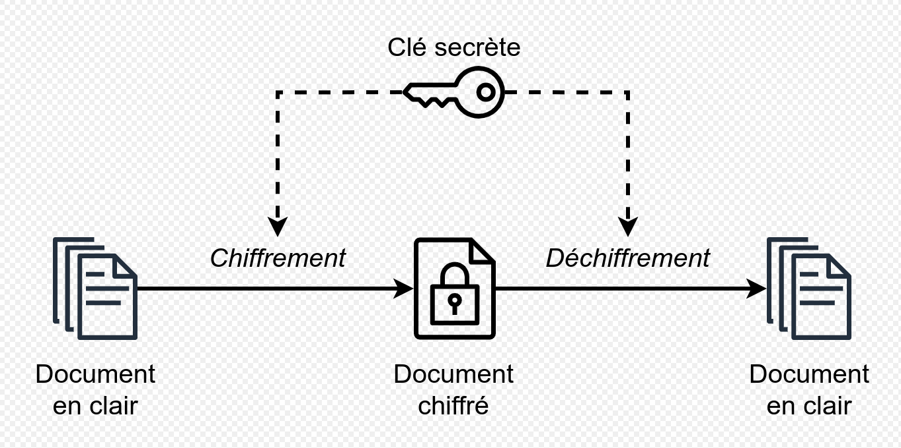
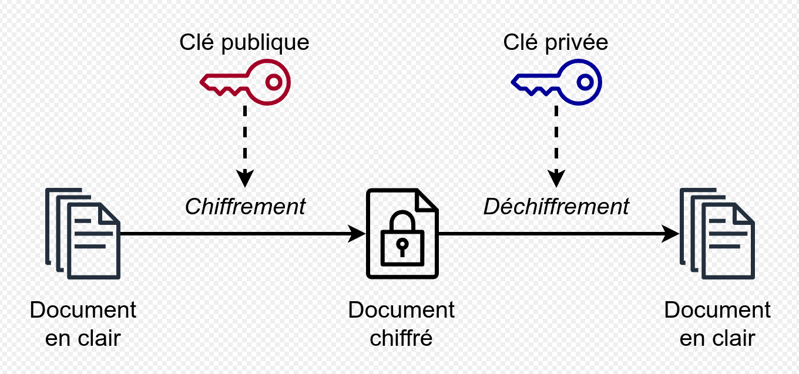
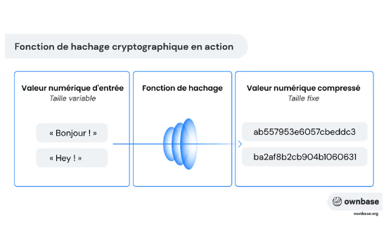
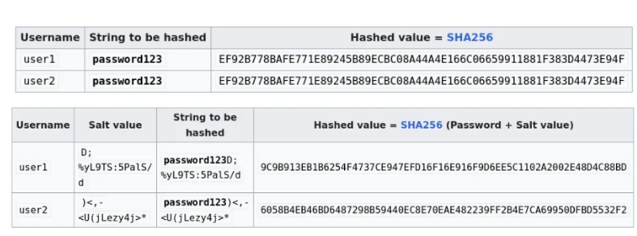
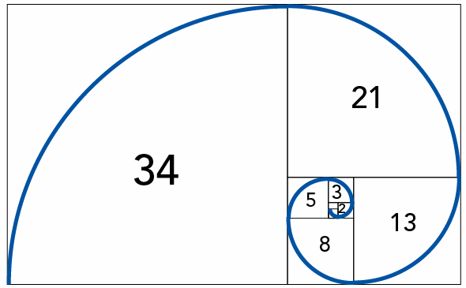

# Les Types de Cryptographie

La cryptographie se divise en plusieurs catégories, chacune ayant ses propres caractéristiques, algorithmes et applications. 

Comprendre ces différents types est essentiel pour choisir la méthode de protection la plus appropriée pour une situation donnée. Ce chapitre explore les principaux types de cryptographie, leurs avantages et leurs inconvénients.

---

## Cryptographie symétrique (Clé Secrète)

La cryptographie symétrique utilise la même clé pour chiffrer et déchiffrer les données. L'expéditeur et le destinataire doivent partager la clé secrète en toute sécurité avant de pouvoir communiquer.



### Avantages
*   **Rapidité :** Les algorithmes symétriques sont généralement plus rapides que les algorithmes asymétriques.
*   **Simplicité :** Les algorithmes sont plus simples à mettre en œuvre et à comprendre.

### Inconvénients
*   **Distribution des Clés :** La nécessité de partager la clé secrète de manière sécurisée est un défi majeur.
*   **Gestion des Clés :** La gestion des clés devient complexe dans les environnements avec de nombreux participants.

### Algorithmes Courants
*   **AES (Advanced Encryption Standard) :** L'un des algorithmes les plus utilisés aujourd'hui, offrant une excellente sécurité et performance.
*   **DES (Data Encryption Standard) :** Plus ancien et moins sécurisé que l'AES, mais toujours utilisé dans certains systèmes hérités.
*   **3DES (Triple DES) :** Une amélioration de DES, appliquant l'algorithme DES trois fois pour renforcer la sécurité.
*   **Blowfish et Twofish :** Algorithmes rapides et sécurisés, souvent utilisés dans les applications open source.

### Cas d'Utilisation
*   Chiffrement des fichiers et des disques durs.
*   Chiffrement des communications sur les réseaux privés.
*   Protection des données stockées dans les bases de données.

---

## Cryptographie asymétrique (Clé Publique)



La cryptographie asymétrique utilise une paire de clés : une clé publique, qui peut être partagée avec tout le monde, et une clé privée, qui doit être gardée secrète par son propriétaire. La clé publique est utilisée pour chiffrer les données, et la clé privée est utilisée pour les déchiffrer.

Analogie: 

Le chiffrement asymétrique peut être expliqué à l'aide de l'analogie de la **boîte aux lettres** :

*  Imaginez une boîte aux lettres spéciale avec deux fentes : une pour déposer le courrier (la clé publique) et une pour le récupérer (la clé privée).
  *  La fente de dépôt (clé publique) est ouverte à tous. N'importe qui peut y glisser une lettre, comme un facteur déposant du courrier.
  *  La fente de récupération (clé privée) est verrouillée. Seul le propriétaire de la boîte possède la clé pour l'ouvrir et récupérer les lettres.
  *  Une fois qu'une lettre est déposée dans la boîte, elle ne peut plus être récupérée par la fente de dépôt. Seul le propriétaire, avec sa clé privée, peut accéder au contenu.

*  Cette analogie illustre les principes clés du chiffrement asymétrique :
  *  La clé publique (fente de dépôt) peut être partagée librement, permettant à quiconque d'envoyer des messages sécurisés.
  *  La clé privée (clé de la fente de récupération) reste secrète, garantissant que seul le destinataire légitime peut lire les messages.
  *  Une fois le message "déposé" (chiffré), il ne peut être "récupéré" (déchiffré) que par le détenteur de la clé privée.

### Avantages
*   **Facilité de Distribution des Clés :** La clé publique peut être partagée sans risque, ce qui simplifie la distribution des clés.
*   **Authentification et Non-Répudiation :** Permet de signer numériquement les documents, garantissant l'authenticité et la non-répudiation.

### Inconvénients
*   **Lenteur :** Les algorithmes asymétriques sont généralement plus lents que les algorithmes symétriques.
*   **Complexité :** Les algorithmes sont plus complexes à mettre en œuvre et à comprendre.

### Algorithmes Courants
*   **RSA (Rivest-Shamir-Adleman) :** L'un des algorithmes asymétriques les plus utilisés, offrant une bonne sécurité et flexibilité.
*   **ECC (Elliptic Curve Cryptography) :** Un algorithme plus récent offrant une sécurité comparable à RSA avec des clés plus petites, ce qui le rend plus efficace pour les appareils mobiles.
*   **DSA (Digital Signature Algorithm) :** Utilisé pour la création de signatures numériques.

### Cas d'Utilisation
*   Sécurisation des communications sur Internet (HTTPS).
*   Création de signatures numériques pour authentifier les documents.

#### Exemple concret avec des nombres

1. **Les clés**
   * Clé publique : Multiplier par 3
   * Clé privée : Diviser par 3

2. **Chiffrement (avec la clé publique)**
   * Message original : 5
   * Application de la clé publique : 5 × 3 = 15
   * Message chiffré : 15

3. **Déchiffrement (avec la clé privée)**
   * Message chiffré : 15
   * Application de la clé privée : 15 ÷ 3 = 5
   * Message original : 5

4. **Pourquoi c'est sécurisé ?**
   * Tout le monde peut multiplier par 3 (clé publique)
   * Mais diviser précisément par 3 nécessite de connaître l'opération inverse (clé privée)

Note : Cet exemple est très simplifié. Les vrais algorithmes comme RSA utilisent des mathématiques beaucoup plus complexes, mais le principe de base reste le même : une opération facile à faire dans un sens (clé publique) mais difficile à inverser sans information secrète (clé privée).

---

## Fonctions de Hachage

Le développement de fonctions de hachage cryptographiques comme SHA-256 et SHA-3 a permis de vérifier l'intégrité des données et de stocker les mots de passe de manière sécurisée.

**Qu'est-ce qu'un hachage ?**

Une fonction de hachage est un algorithme qui prend une donnée d'entrée (appelée message) de taille arbitraire et la transforme en une sortie de taille fixe, appelée valeur de hachage ou empreinte numérique. 

Par exemple, un texte ou un fichier peut être converti en une chaîne alphanumérique de longueur fixe (comme 256 bits pour SHA-256). 
Cette empreinte est unique pour chaque donnée d'entrée distincte.

Les fonctions de hachage prennent des données en entrée et produisent une empreinte numérique de taille fixe (appelée haché). Les fonctions de hachage sont utilisées pour vérifier l'intégrité des données, stocker les mots de passe de manière sécurisée, et créer des signatures numériques.



Dans le contexte des fonctions de hachage cryptographiques, une préimage fait référence à l'entrée originale (ou message) qui, lorsqu'elle est passée à travers la fonction de hachage, produit une valeur de hachage spécifique.

### Propriétés Essentielles
*   **Unidirectionnalité:** Il doit être pratiquement impossible de retrouver les données d'origine à partir du haché.
*   **Résistance aux Collisions:** Il doit être difficile de trouver deux entrées différentes qui produisent le même haché.

### Algorithmes Courants
*   **SHA-256 (Secure Hash Algorithm 256-bit) :** L'un des algorithmes les plus utilisés, offrant une bonne sécurité et performance.
*   **SHA-3 (Secure Hash Algorithm 3) :** Un algorithme plus récent conçu pour remplacer SHA-256 en cas de vulnérabilité.
*   **MD5 (Message Digest Algorithm 5) :** Plus ancien et moins sécurisé que SHA-256, il est déconseillé de l'utiliser pour les applications critiques.

### Cas d'Utilisation
*   Vérification de l'intégrité des fichiers téléchargés.
*   Stockage sécurisé des mots de passe.
*   Création de signatures numériques.

**Exemple: mots de passe dans un site web:** 

- Inscription : Lorsqu'un utilisateur crée un compte, il fournit un mot de passe. Ce mot de passe est passé dans l'algorithme de hachage qui produit une empreinte unique (le hash).
- Stockage : Le site web stocke cette empreinte dans sa base de données, mais pas le mot de passe original.
- Connexion : Quand l'utilisateur revient et entre son mot de passe pour se connecter, le site web passe à nouveau ce mot de passe dans le méme algo de hachage.
- Vérification : Le site compare la nouvelle empreinte avec celle stockée dans la base de données. Si elles correspondent, l'accès est accordé.

**Pourquoi ne peut-on pas retrouver le mot de passe à partir du hash ?**

- Fonction à sens unique : Les algorithmes de hachage sont conçus pour être unidirectionnels. Il n'existe pas de "formule inverse" pour revenir en arrière.
- Perte d'information : Le processus de hachage condense délibérément l'information, rendant impossible la reconstruction du mot de passe original.
- Résistance aux collisions : Même si deux mots de passe différents peuvent théoriquement produire le même hash (une collision), les algorithmes modernes rendent cela extrêmement improbable

**Le sel, un element de sécurité en plus**

Le salage est un processus par lequel des données aléatoires sont ajoutées à une entrée avant qu’elle ne soit traitée par un algorithme de hachage.



Exemple d'algorithmes de hachage qui intègrent le sel par défaut :

- **bcrypt**: Un algorithme de hachage adaptatif conçu spécifiquement pour le stockage sécurisé des mots de passe. Il génère automatiquement un sel aléatoire et l'intègre dans la chaîne de hachage résultante. bcrypt permet d'ajuster le facteur de coût pour ralentir intentionnellement le processus de hachage, le rendant très résistant aux attaques par force brute

- **Argon2**: intègre automatiquement un sel dans son processus et permet de paramétrer la mémoire utilisée, le temps de calcul et le degré de parallélisme, offrant ainsi une flexibilité et une sécurité accrues

---

## Cryptographie Hybride

La cryptographie hybride combine les avantages de la cryptographie symétrique et asymétrique. Elle utilise la cryptographie asymétrique pour échanger une clé secrète, puis utilise la cryptographie symétrique pour chiffrer les données.

### Avantages
*   **Sécurité :** Bénéficie de la sécurité de la cryptographie asymétrique pour l'échange de clés.
*   **Performance :** Utilise la cryptographie symétrique pour le chiffrement des données, ce qui est plus rapide.

### Inconvénients
*   **Complexité :** Plus complexe à mettre en œuvre que la cryptographie symétrique ou asymétrique seule.

### Cas d'Utilisation
*   Sécurisation des communications sur Internet (TLS/SSL).
*   Chiffrement des emails (PGP/GPG).


## Faire son propre algo de cryptographie

Il est fortement déconseillé d'utiliser des algorithmes de cryptographie "maison" en production. Les algorithmes standards (AES, RSA, etc.) ont été rigoureusement testés par la communauté cryptographique. Cependant, comprendre comment fonctionne un algorithme simple peut être instructif.

#### Fonctionnement

Cryptographie avec la suite de Fibbonachi



1. **Préparation**
   * Choisir une position de départ dans la suite (ex: position 5)
   * Les nombres suivants serviront de "clé de chiffrement"

2. **Exemple de chiffrement**
   * Message : "HELLO"
   * Position de départ : 5 (correspond au nombre 5 dans la suite)
   * Pour chaque lettre :
     - H : décalage de 5 positions
     - E : décalage de 8 positions
     - L : décalage de 13 positions
     - L : décalage de 21 positions
     - O : décalage de 34 positions

3. **Visualisation**
   ```
   Message  : H    E    L    L    O
   Décalage : 5    8    13   21   34
   Résultat : M    M    Y    G    M
   ```

4. **Déchiffrement**
   * Pour retrouver le message original, on effectue l'opération inverse :
   * On soustrait le décalage au lieu de l'ajouter
   ```
   Chiffré  : M    M    Y    G    M
   Décalage : 5    8    13   21   34
   Original : H    E    L    L    O
   ```
   
   Exemple détaillé :
   - M (position -5) → H
   - M (position -8) → E
   - Y (position -13) → L
   - G (position -21) → L
   - M (position -34) → O

Note : Pour déchiffrer, il est crucial de :
- Connaître la position de départ (ici 5)
- Reconstruire la même suite de Fibonacci
- Appliquer les décalages en sens inverse

Il s'agit d'un **algorithme de chiffrement symétrique** car la même information est utilisée pour chiffrer et déchiffrer.

#### Clés de chiffrement

1. **Clé secrète**
  * La position de départ dans la suite de Fibonacci (ici 5)
  * Cette information doit rester secrète et être partagée uniquement entre l'émetteur et le récepteur
  * C'est la clé principale qui permet le chiffrement et le déchiffrement

2. **Information publique**
  * La suite de Fibonacci elle-même est publique et connue de tous
  * L'algorithme de chiffrement/déchiffrement peut être connu
  * Le message chiffré peut être intercepté

#### Sécurité de l'algorithme

1. **Forces**
  * Simple à comprendre et à implémenter
  * Les nombres de Fibonacci grandissent rapidement, créant des décalages importants

2. **Faiblesses**
  * Nombre limité de positions de départ utiles
  * La suite de Fibonacci est prévisible
  * Vulnérable à l'analyse fréquentielle
  * Une fois la position de départ trouvée, tout le système est compromis

#### Comparaison avec les standards modernes

Par rapport à un algorithme symétrique moderne comme AES :

* AES utilise une clé de 128, 192 ou 256 bits

* Notre algorithme Fibonacci n'utilise qu'un nombre (position) comme clé

* AES utilise des opérations complexes (SubBytes, ShiftRows, MixColumns)

* Notre algorithme utilise un simple décalage basé sur une suite mathématique

Il existe plusieurs types de cryptographie, chacun ayant ses propres avantages, inconvénients et applications. 

Le choix du type de cryptographie approprié dépend des besoins spécifiques en matière de sécurité, de performance et de complexité. 

---
