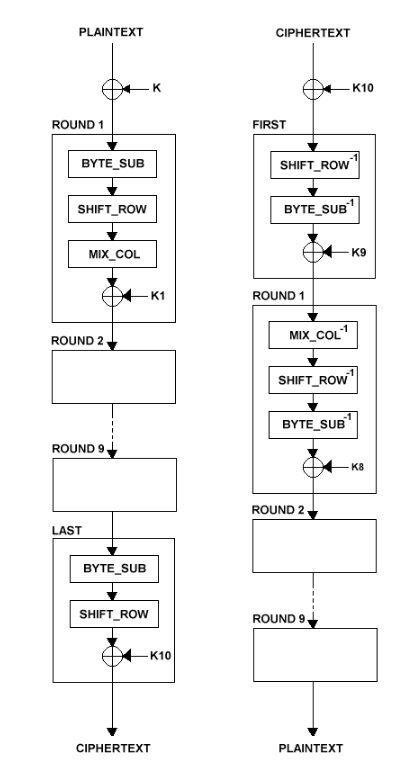

# Algo AES (chiffrement symétrique) 

L'AES, ou Advanced Encryption Standard, est un algorithme de chiffrement symétrique largement adopté et considéré comme l'un des plus robustes et sécurisés disponibles aujourd'hui. Il est utilisé pour protéger une grande variété de données sensibles, allant des communications en ligne aux fichiers stockés sur des disques durs.

## Histoire 

* **Besoin d'un nouveau standard :** Au milieu des années 1990, le DES (Data Encryption Standard), alors largement utilisé, commençait à montrer ses limites en termes de sécurité en raison de la taille de sa clé (56 bits). Le NIST (National Institute of Standards and Technology) lança alors un appel à propositions pour un nouvel algorithme de chiffrement.
* **Rijndael :** L'algorithme Rijndael, développé par les cryptologues belges Joan Daemen et Vincent Rijmen, fut sélectionné parmi plusieurs candidats.
* **Standardisation :** En 2001, le NIST a officialisé Rijndael sous le nom d'AES (Advanced Encryption Standard), publié sous la norme FIPS PUB 197.

## Caractéristiques clés

* **Chiffrement symétrique :** AES utilise la même clé pour chiffrer et déchiffrer les données.
* **Taille des clés variables :** AES supporte des clés de 128, 192 ou 256 bits, offrant différents niveaux de sécurité. AES-256 est considéré comme extrêmement sûr et est utilisé pour les informations les plus sensibles.
* **Taille des blocs :** AES opère sur des blocs de données de 128 bits.
* **Rounds (tours) :** Le nombre de tours de chiffrement varie en fonction de la taille de la clé :
  * 10 tours pour les clés de 128 bits
  * 12 tours pour les clés de 192 bits
  * 14 tours pour les clés de 256 bits

## Fonctionnement 

*  **SubBytes (Substitution des octets)**
  *  Chaque octet (8 bits) du bloc est remplacé par un autre octet.
  *  Le remplacement se fait selon une table prédéfinie appelée "S-box".
  *  Cette opération rend la relation entre la clé et le texte chiffré plus complexe.
  *  Elle aide à protéger contre certains types d'attaques cryptographiques.

*  **ShiftRows (Décalage des lignes)**
  *  Le bloc de données est organisé en une grille de 4x4 octets.
  *  Chaque ligne de cette grille est décalée vers la gauche, mais de façon différente (La première ligne ne change pas, La deuxième ligne est décalée d'un octet vers la gauche,La troisième ligne est décalée de deux octets vers la gauche..)
  *  Cette étape permet de mélanger les données entre les différentes colonnes.

*  **MixColumns (Mélange des colonnes)**
  *  Chaque colonne de la grille 4x4 est traitée séparément.
  *  Les quatre octets de chaque colonne sont combinés à l'aide d'une opération mathématique.
  *  Cette opération fait en sorte que chaque octet de sortie dépende de tous les octets d'entrée de la colonne.
  *  Elle assure une diffusion rapide des données, ce qui renforce la sécurité du chiffrement.

Ces trois opérations sont appliquées plusieurs fois (en "rounds" ou tours) lors du processus de chiffrement, chaque fois avec une clé différente dérivée de la clé principale. Ensemble, elles créent un mélange complexe des données qui est très difficile à inverser sans la clé correcte

## Sécurité et adoption

* **Robustesse :** AES est largement considéré comme très résistant aux attaques cryptanalytiques connues.
* **Adoption globale :** Il est utilisé dans de nombreux protocoles (HTTPS, TLS, IPsec), logiciels (logiciels de chiffrement de fichiers, gestionnaires de mots de passe) et matériels (processeurs, disques durs chiffrés).
* **Usage gouvernemental :** AES est approuvé par le gouvernement américain pour le chiffrement des informations classifiées.

## Points importants

* La robustesse de l'AES est fortement liée à la taille de la clef utilisé. Une clef de 256 bits, est considéré comme incassable avec les technologies d'aujourd'hui.
* Même si l'algorithme est reconnu comme très robuste, une mauvaise implémentation, ou une mauvaise gestion des clefs peut créer des failles de sécurités.
* AES est u

