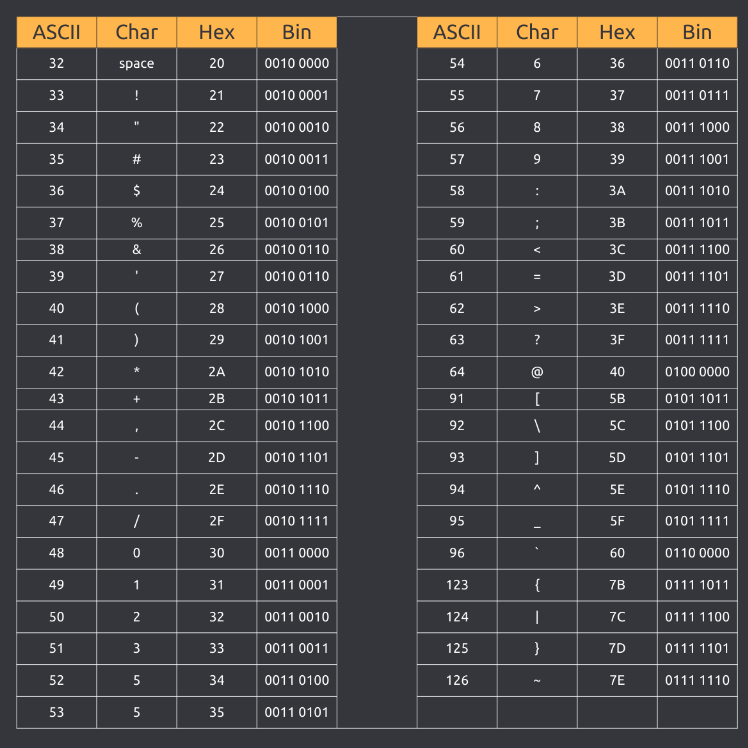
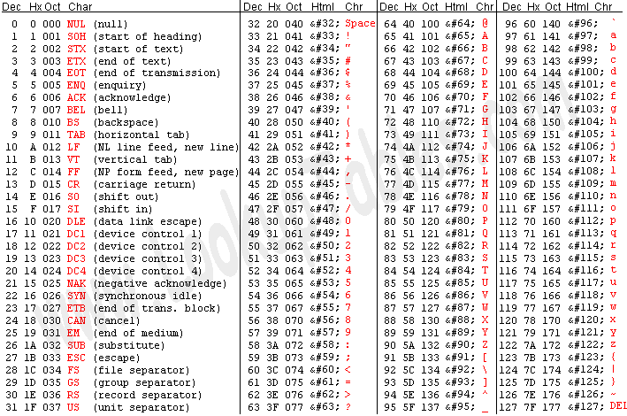
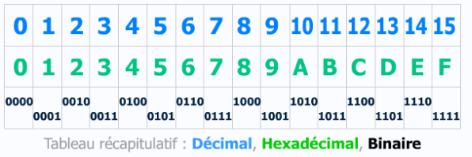
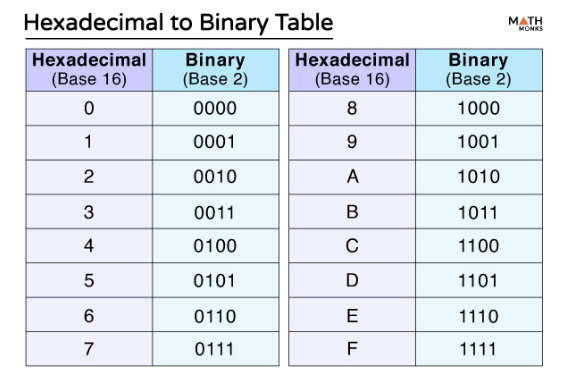

# TP : Cryptographie simple (ASCII)

## Exercice : cryptographie (ASCII)

[TP: Challenge root-me](https://www.root-me.org/fr/Challenges/Cryptanalyse/Encodage-ASCII)

L'ASCII est un encodage simple qui associe chaque caractère à un nombre compris entre 0 et 127.

**Hash:** 4C6520666C6167206465206365206368616C6C656E6765206573743A203261633337363438316165353436636436383964356239313237356433323465

Ce hash représente une chaîne de caractères ASCII encodée en hexadécimal

Table binaire - Hex - Char ASCII: 

Table ASCII: 

Le système hexadécimal est un système de numération en base 16, qui utilise 16 symboles différents pour représenter les nombres. Ces symboles sont

- Les chiffres de 0 à 9 pour représenter les valeurs de zéro à neuf

- Les lettres de A à F pour représenter les valeurs de dix à quinze

En hexadécimal, nous avons :
0, 1, 2, 3, 4, 5, 6, 7, 8, 9, A, B, C, D, E, F

- Base 2 (Binaire)= 2 symboles 

- Base 10 (décimal) = 10 Symboles

- Base 16 (Hexadecimal) = 16 Symboles

Ce système est particulièrement utile en informatique car il offre un compromis pratique entre le code binaire utilisé par les machines et une représentation plus compacte et lisible pour les humains

### Solutions: 

Le flag de ce challenge est: 2ac376481ae546cd689d5b91275d324e

**Stratégie:**

| Étape | Description | Exemple |
|-------|-------------|---------|
| 1. Séparation | Divisez la chaîne hexadécimale en paires de deux caractères | "48 65 6C 6C 6F" |
| 2. Conversion en décimal (Pas obligatoire) | Convertissez chaque paire hexadécimale en sa valeur décimale | 48 = 72, 65 = 101, 6C = 108, 6C = 108, 6F = 111 |
| 3. Correspondance ASCII | Trouvez le caractère ASCII correspondant à chaque valeur décimale/Hexa | 72 = 'H', 101 = 'e', 108 = 'l', 108 = 'l', 111 = 'o' |
| 4. Assemblage | Assemblez les caractères ASCII pour former le texte final | "Hello" |

**Solution:**

| Hex | Décimal | ASCII |
|-----|---------|-------|
| 4C 65 20 66 6C 61 67 20 64 65 20 63 65 20 63 68 61 6C 6C 65 6E 67 65 20 65 73 74 3A 20 32 61 63 33 37 36 34 38 31 61 65 35 34 36 63 64 36 38 39 64 35 62 39 31 32 37 35 64 33 32 34 65 | 76 101 32 102 108 97 103 32 100 101 32 99 101 32 99 104 97 108 108 101 110 103 101 32 101 115 116 58 32 50 97 99 51 55 54 52 56 49 97 101 53 52 54 99 100 54 56 57 100 53 98 57 49 50 55 53 100 51 50 52 101 | L e   f l a g   d e   c e   c h a l l e n g e   e s t :   2 a c 3 7 6 4 8 1 a e 5 4 6 c d 6 8 9 d 5 b 9 1 2 7 5 d 3 2 4 e |

Avec décomposition:

| Hex | Décimal | ASCII |
|-----|---------|-------|
| 4C | 76 | L |
| 65 | 101 | e |
| 20 | 32 | (espace) |
| 66 | 102 | f |
| 6C | 108 | l |
| 61 | 97 | a |
| 67 | 103 | g |
| 20 | 32 | (espace) |
| 64 | 100 | d |
| 65 | 101 | e |
| 20 | 32 | (espace) |
| 63 | 99 | c |
| 65 | 101 | e |
| 20 | 32 | (espace) |
| 63 | 99 | c |
| 68 | 104 | h |
| 61 | 97 | a |
| 6C | 108 | l |
| 6C | 108 | l |
| 65 | 101 | e |
| 6E | 110 | n |
| 67 | 103 | g |
| 65 | 101 | e |
| 20 | 32 | (espace) |
| 65 | 101 | e |
| 73 | 115 | s |
| 74 | 116 | t |
| 3A | 58 | : |
| 20 | 32 | (espace) |
| 32 | 50 | 2 |
| 61 | 97 | a |
| 63 | 99 | c |
| 33 | 51 | 3 |
| 37 | 55 | 7 |
| 36 | 54 | 6 |
| 34 | 52 | 4 |
| 38 | 56 | 8 |
| 31 | 49 | 1 |
| 61 | 97 | a |
| 65 | 101 | e |
| 35 | 53 | 5 |
| 34 | 52 | 4 |
| 36 | 54 | 6 |
| 63 | 99 | c |
| 64 | 100 | d |
| 36 | 54 | 6 |
| 38 | 56 | 8 |
| 39 | 57 | 9 |
| 64 | 100 | d |
| 35 | 53 | 5 |
| 62 | 98 | b |
| 39 | 57 | 9 |
| 31 | 49 | 1 |
| 32 | 50 | 2 |
| 37 | 55 | 7 |
| 35 | 53 | 5 |
| 64 | 100 | d |
| 33 | 51 | 3 |
| 32 | 50 | 2 |
| 34 | 52 | 4 |
| 65 | 101 | e |

