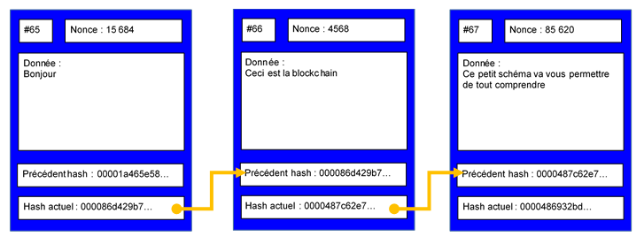
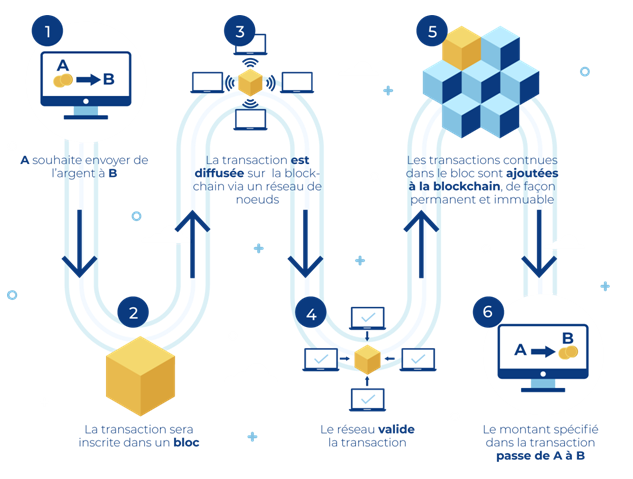

# Blockchain

## Introduction

Une blockchain est une base de données distribuée, partagée et immuable qui enregistre des transactions de manière sécurisée et transparente. Les transactions sont regroupées en blocs, qui sont ensuite liés entre eux de manière chronologique en utilisant la cryptographie. Une fois qu'un bloc est ajouté à la chaîne, il ne peut plus être modifié, ce qui garantit l'intégrité et la sécurité des données.

La Blockchain est une technologie pair-à-pair (peer-to-peer) de stockage et de partage, on peut la définir comme une base de données (blocs de donnés) ou plus simplement comme un « Grand Registre » décentralisé, public, anonyme, infalsifiable et sécurisé.

La première Blockchain est apparue en 2008 avec l’apparition du Bitcoin, la première monnaie virtuelle décentralisée utilisant cette technologie.

### Pourquoi la Blockchain est-elle importante ?
*   **Décentralisation :** Pas de point de contrôle unique, ce qui réduit les risques de censure et de manipulation.
*   **Transparence :** Toutes les transactions sont enregistrées publiquement et peuvent être consultées par tous les participants.
*   **Sécurité :** La cryptographie et le consensus distribué assurent l'intégrité et la sécurité des données.
*   **Immuabilité :** Une fois qu'une transaction est enregistrée, elle ne peut plus être modifiée, ce qui garantit la pérennité des données.
*   **Efficacité :** Automatisation des processus et réduction des intermédiaires, ce qui permet d'améliorer l'efficacité et de réduire les coûts.

## Principes clés de la blockchain

### 1. Décentralisation
*   La blockchain est distribuée sur plusieurs nœuds (ordinateurs) qui valident et stockent les données.
*   Aucun nœud central n'a le contrôle total sur la blockchain, ce qui réduit les risques de censure et de manipulation.

### 2. Transparence
*   Toutes les transactions sont enregistrées publiquement et peuvent être consultées par tous les participants.
*   L'historique des transactions est visible et vérifiable, ce qui améliore la confiance et la transparence.

### 3. Immuabilité
*   Une fois qu'un bloc est ajouté à la chaîne, il ne peut plus être modifié.
*   Les modifications nécessiteraient de modifier tous les blocs suivants, ce qui est pratiquement impossible grâce à la cryptographie et au consensus distribué.

### 4. Cryptographie
*   La cryptographie est utilisée pour sécuriser les transactions, vérifier l'identité des participants, et protéger les données.
*   Les fonctions de hachage, les signatures numériques et le chiffrement sont utilisés pour assurer l'intégrité et la confidentialité des données.

### 5. Consensus Distribué
*   Les nœuds de la blockchain doivent s'entendre sur la validité des transactions avant qu'elles ne soient ajoutées à la chaîne.
*   Différents mécanismes de consensus existent, tels que la preuve de travail (Proof of Work) et la preuve d'enjeu (Proof of Stake).

## Types de blockchains

### 1. Blockchain publique
*   **Description :** Ouverte à tous, n'importe qui peut participer, valider les transactions et consulter l'historique.
*   **Exemples :** Bitcoin, Ethereum, Litecoin.
*   **Cas d'utilisation :** Cryptomonnaies, applications décentralisées (dApps).

### 2. Blockchain privée
*   **Description :** Restreinte à un groupe spécifique d'utilisateurs, gérée par une organisation ou une entreprise.
*   **Exemples :** Hyperledger Fabric, Corda.
*   **Cas d'utilisation :** Gestion de la chaîne d'approvisionnement, systèmes de vote sécurisés, registres de propriété.

### 3. Blockchain de Consortium
*   **Description :** Gérée par un groupe d'organisations ou d'entreprises, avec des règles de participation définies.
*   **Exemples :** Plateformes de trading de matières premières, réseaux de paiement interbancaires.
*   **Cas d'utilisation :** Collaboration inter-entreprises, échanges de données sécurisés.
---

## Cas d'utilisation de la blockchain

1. Cryptomonnaies

*   Bitcoin et autres cryptomonnaies utilisent la blockchain pour enregistrer les transactions de manière sécurisée et transparente.
*   La blockchain permet de créer une monnaie numérique décentralisée, indépendante des institutions financières traditionnelles.

2. Chaîne d'Approvisionnement

*   La blockchain permet de suivre les produits tout au long de la chaîne d'approvisionnement, de la production à la livraison.
*   Elle améliore la transparence, la traçabilité et l'efficacité, et réduit les risques de contrefaçon et de fraude.

3. Santé

*   La blockchain permet de sécuriser et de partager les dossiers médicaux des patients.
*   Elle améliore la confidentialité, l'interopérabilité et la sécurité des données, et facilite la recherche médicale.

4. Vote électronique

*   La blockchain permet de créer des systèmes de vote électronique sécurisés et transparents.
*   Elle améliore la confiance, la transparence et l'intégrité des élections, et réduit les risques de fraude.

5. Identité numérique

*   La blockchain permet de créer des identités numériques sécurisées et décentralisées.
*   Elle améliore la confidentialité, la sécurité et la portabilité des données personnelles, et réduit les risques de vol d'identité.

6. Gestion des droits d'auteur

*   La blockchain permet de gérer et de protéger les droits d'auteur des créateurs de contenu.
*   Elle facilite la traçabilité des œuvres, la gestion des licences, et la perception des droits d'auteur.

## Défis de la blockchain

### 1. Scalabilité

*   La blockchain peut être lente et coûteuse à cause de la validation des transactions par plusieurs nœuds.
*   Les solutions de scalabilité, telles que les sidechains et le sharding, sont en cours de développement pour améliorer les performances.

### 2. Coût énergétique

*   Les mécanismes de consensus, tels que la preuve de travail (Proof of Work), peuvent consommer beaucoup d'énergie.
*   Les alternatives, telles que la preuve d'enjeu (Proof of Stake), sont plus économes en énergie.

### 3. Réglementation

*   Le manque de réglementation claire et harmonisée peut freiner l'adoption de la blockchain.
*   Les gouvernements doivent établir un cadre juridique clair pour encadrer l'utilisation de la blockchain.

### 4. Sécurité

*   Bien que la blockchain soit réputée sécurisée, elle n'est pas à l'abri des attaques.
*   Les vulnérabilités dans les smart contracts et les portefeuilles électroniques peuvent être exploitées par des pirates.

### 5. Adoption

*   L'adoption de la blockchain est encore limitée par le manque de sensibilisation et de compréhension.
*   Les entreprises doivent investir dans la formation et la sensibilisation pour encourager l'adoption de la blockchain.

---
